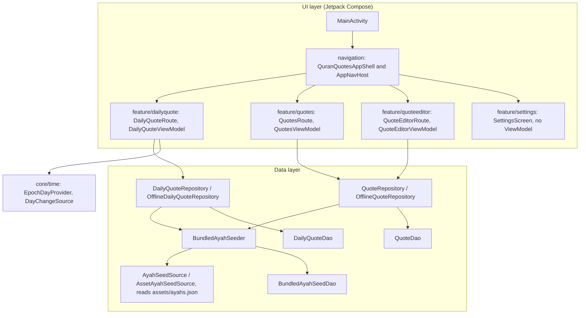
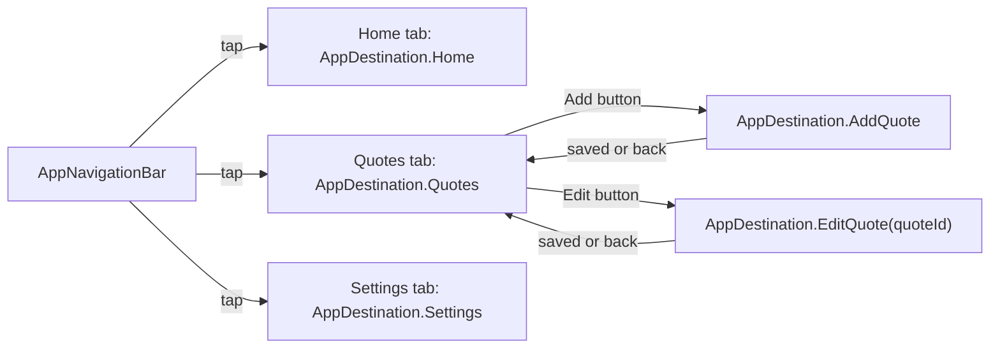
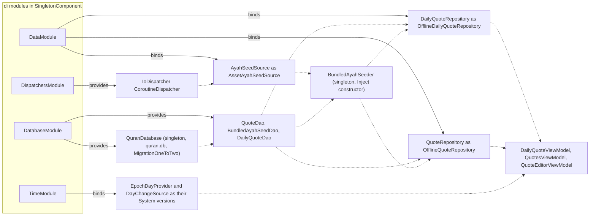

# Developer Architecture

The app follows MVVM, as described in the official Android app architecture guide. There is a UI layer and a data layer. A domain layer (use cases) is optional and only added when logic is shared between ViewModels or is too complex for one. The app has no use cases yet.

Why this shape? Each layer depends only on interfaces below it, and every dependency comes in through the constructor. That makes every class testable with simple fakes, which the 100% coverage rule relies on.

## The layers

The UI layer has a navigation shell and four screens: Home (the daily quote), Quotes (the list), the quote editor, and Settings. The data layer has two repositories that share one seeder.

This diagram shows the layers and which class depends on which.

## UI layer

- Compose only. There are no XML layouts or Fragments.
- `MainActivity` shows `QuranQuotesAppShell`: the bottom navigation bar and the `AppNavHost` with every screen. See [Navigation](Developer-Navigation.md).
- Each screen has a ViewModel that exposes immutable state as a `StateFlow`: `DailyQuoteUiState`, `QuotesUiState`, and `QuoteEditorUiState`.
- Each screen is split in two. The **route** (for example `DailyQuoteRoute`) gets the ViewModel with `hiltViewModel()`, collects state with `collectAsStateWithLifecycle()`, and wires up events. The **screen** (for example `DailyQuoteScreen`) only takes state and lambdas. That split is why screens can have previews and simple UI tests.
- The one exception is `SettingsScreen`. It is a placeholder with no state and no events, so it is a plain stateless composable with no ViewModel. It gets one as soon as it gets a real setting.
- Screens never navigate by themselves. A route takes callbacks such as `onAddQuote`, `onEditQuote`, and `onDone`, and `AppNavHost` connects them to the `NavController`.
- Composables hold no business logic. Mapping rules live in plain classes and functions that unit tests can check: `DailyQuoteCard` and `DailyQuoteOriginNote` (what the Home card shows), `QuoteListCard` and `QuoteListKind` (what a list card shows, and its origin label), and `QuoteDraftValidator` (the editor's rules).
- Code shared by more than one feature lives in `ui/`: `ui/components/` holds the two native top app bars, `TopLevelTopAppBar` and `DetailTopAppBar` (see Native Material 3 UI below), `ui/text/ArabicAnnotatedText.kt` marks Arabic text for TalkBack, and `ui/preview/LightDarkLargeFontPreviews.kt` is a preview annotation for light, dark, and large font. A feature package never imports from another feature package.

This diagram shows the destinations: three bottom tabs, and the two editor destinations that open from the Quotes tab.

## Data layer

- Repositories are the single source of truth and the only thing a ViewModel talks to for data.
- Room holds every quote, bundled or the user's own, in one `quotes` table, next to `seeded_bundled_keys` and `ayah_seed_info`. Every row is real user data, because the user can edit and delete any quote. See [Ayah Data](Developer-Ayah-Data.md).
- DataStore will hold user settings when Settings gets real options. SharedPreferences is never used.
- `BundledAyahSeeder` is a `@Singleton`. Once per process it merges the current bundled seed into Room through `BundledAyahSeedDao.mergeBundledSeed`, without undoing any edit or delete the user made. Both repositories call it before they read.
- `OfflineDailyQuoteRepository` seeds, then asks `DailyQuoteDao` for the quote of the day. See [Daily Ayah Logic](Developer-Daily-Ayah-Logic.md).
- `OfflineQuoteRepository` seeds, then serves the whole list as a `Flow` through `QuoteDao`, and adds, reads, updates, and deletes any quote. See [Quotes and Editor](Developer-Quotes-And-Editor.md).
- Both read in the same order, `quoteDisplayOrder` (`data/local/QuoteDisplayOrder.kt`), so the Quotes list and the daily rotation always agree.
- The models the UI sees live in `model/`: `Ayah` (a seed ayah from the asset), `Quote` (a sealed type with `Quote.AyahQuote` and `Quote.FreeTextQuote`, both with `quoteId` and `origin`), `QuoteOrigin` (`BUNDLED`, `EDITED_BUNDLED`, `USER`), and `QuoteDraft` (the fields the editor saves).

## Concurrency

Kotlin Coroutines and Flow are used everywhere:

- ViewModels launch work in `viewModelScope`.
- DAOs use `suspend` for one-shot work and return `Flow` for observed queries (`QuoteDao.observeQuotes`). Work that must be consistent runs in one `@Transaction`: `BundledAyahSeedDao.mergeBundledSeed`, `QuoteDao.updateQuote`, and `DailyQuoteDao.getDailyQuote`.
- `QuotesViewModel` turns the list `Flow` into a `StateFlow` with `stateIn` and `SharingStarted.WhileSubscribed(5_000)`, so the list survives a rotation.
- Dispatchers are injected, never hard-coded. `AssetAyahSeedSource` receives its dispatcher through the `@IoDispatcher` qualifier, so tests can swap it.

## Dependency injection with Hilt

Hilt is the only DI framework. `AlQuranQuotesApp` is `@HiltAndroidApp` and `MainActivity` is `@AndroidEntryPoint`. `DailyQuoteViewModel`, `QuotesViewModel`, and `QuoteEditorViewModel` are `@HiltViewModel`. Never construct a ViewModel by hand in UI code.

All modules live in `app/src/main/java/shibbir/me/alquranquotes/di/` and are installed in `SingletonComponent`:

| Module | Provides |
| --- | --- |
| `DataModule` | `@Binds` `DailyQuoteRepository` to `OfflineDailyQuoteRepository`, `QuoteRepository` to `OfflineQuoteRepository`, and `AyahSeedSource` to `AssetAyahSeedSource`. |
| `DatabaseModule` | `@Provides` the singleton `QuranDatabase` (file `quran.db`, with `MigrationOneToTwo` registered) and its `QuoteDao`, `BundledAyahSeedDao`, and `DailyQuoteDao`. |
| `DispatchersModule` | `@Provides` the `@IoDispatcher` `CoroutineDispatcher` (`Dispatchers.IO`). |
| `TimeModule` | `@Binds` `EpochDayProvider` to `SystemEpochDayProvider`, and `DayChangeSource` to `SystemDayChangeSource`. |

The rule of thumb: bind interfaces with `@Binds`, and use `@Provides` for Room, DataStore, and dispatchers.

This graph shows what each module provides or binds (solid arrows) and where Hilt injects each object (dotted arrows).

A few details the graph leaves out:

- `BundledAyahSeeder` needs no module. It has an `@Inject constructor` and is marked `@Singleton`, so both repositories share one instance and one "already checked" flag.
- The two repositories are not singletons themselves. They hold no state, so a new instance per ViewModel is fine.
- `QuoteDraftValidator` also has a plain `@Inject constructor` and is injected into `QuoteEditorViewModel`.
- Hilt gives every `@HiltViewModel` its `SavedStateHandle`. `QuoteEditorViewModel` reads the edited quote's id from it.
- `AssetAyahSeedSource` and `SystemDayChangeSource` also receive the `@ApplicationContext`, which Hilt supplies itself.

## From asset to Home

1. `MainActivity` sets the theme and shows `QuranQuotesAppShell`, which starts on the Home tab and shows `DailyQuoteRoute`.
2. Hilt creates `DailyQuoteViewModel`. On creation it reads today from `EpochDayProvider` and starts a load.
3. The ViewModel calls `DailyQuoteRepository.getDailyQuote(epochDay)`.
4. `OfflineDailyQuoteRepository` calls `BundledAyahSeeder.ensureStoredSeedIsCurrent()`. The first call in the process loads `ayahs.json` through `AssetAyahSeedSource` and compares versions. If needed, it merges the seed into `quotes`, keeping every change the user made.
5. `DailyQuoteDao.getDailyQuote` reads every quote in one transaction, sorts them with `quoteDisplayOrder`, picks today's, and returns a `Quote`.
6. The ViewModel sets `DailyQuoteUiState.Success`. The screen turns the `Quote` into a `DailyQuoteCard` with `toDailyQuoteCard()` and draws it. No quote at all, or an exception, becomes `Error`, which shows a Retry button.

More detail: [Ayah Data](Developer-Ayah-Data.md) covers step 4, and [Daily Ayah Logic](Developer-Daily-Ayah-Logic.md) covers steps 2 and 5 and what happens when the day changes. [Quotes and Editor](Developer-Quotes-And-Editor.md) covers the Quotes tab and the editor.

## Native Material 3 UI

The app uses the stock Material 3 components with their default look, so it feels like a native Android app, similar to the system Settings app. There are no custom colors on the bars and no hand-made collapsing headers.

- **Tabs** (Home, Quotes, Settings) use `TopLevelTopAppBar` (`ui/components/TopLevelTopAppBar.kt`), a thin wrapper around `LargeTopAppBar`. The title starts large and collapses into a small bar as the content scrolls. Each tab screen:
  1. creates `TopAppBarDefaults.exitUntilCollapsedScrollBehavior()`,
  2. adds `Modifier.nestedScroll(scrollBehavior.nestedScrollConnection)` to its `Scaffold`,
  3. passes the scroll behavior to `TopLevelTopAppBar`,
  4. makes its content scrollable (a `LazyColumn` on Quotes, `verticalScroll` on Home and Settings), because the bar only collapses when the content scrolls.
- **Detail screens** (the quote editor) use `DetailTopAppBar` (`ui/components/DetailTopAppBar.kt`), a wrapper around `TopAppBar` with a back arrow (`Icons.AutoMirrored.Filled.ArrowBack`, so it flips for right to left), a title, and optional `actions` such as Save. It is paired with `TopAppBarDefaults.pinnedScrollBehavior()`: the bar stays in place and tints when content scrolls under it.
- Both bars mark their title as a heading for TalkBack. `TopLevelTopAppBarTest` and `DetailTopAppBarTest` check that, the back button, and the actions.
- **Colors:** the bars keep the default Material 3 colors (the surface color, tinted on scroll). `AlQuranQuotesTheme` in `ui/theme/Theme.kt` uses Material You dynamic color on Android 12 and newer (`useDynamicColor = true`), and the static schemes from `Color.kt` on older devices. Custom brand colors will not show on Android 12+ unless dynamic color is turned off.
- **Add button:** the Quotes tab uses an `ExtendedFloatingActionButton` (`AddQuoteButton`) that shows "Add quote" at the top of the list and shrinks to its icon once the list scrolls.
- **Bottom bar:** the tabs use the Material 3 `NavigationBar` (`AppNavigationBar`). It is hidden on the editor.
- **Motion:** screens change with the Material 3 "fade through" from `NavigationMotion`, not the slow default crossfade.

See [Navigation](Developer-Navigation.md) for the bottom bar, the transitions, and window insets.

These scroll behaviors are still marked experimental in Material 3 1.4, so the screens that use them opt in with `@OptIn(ExperimentalMaterial3Api::class)`.

[Back to the Developer Guide](Developer-Guide.md)
