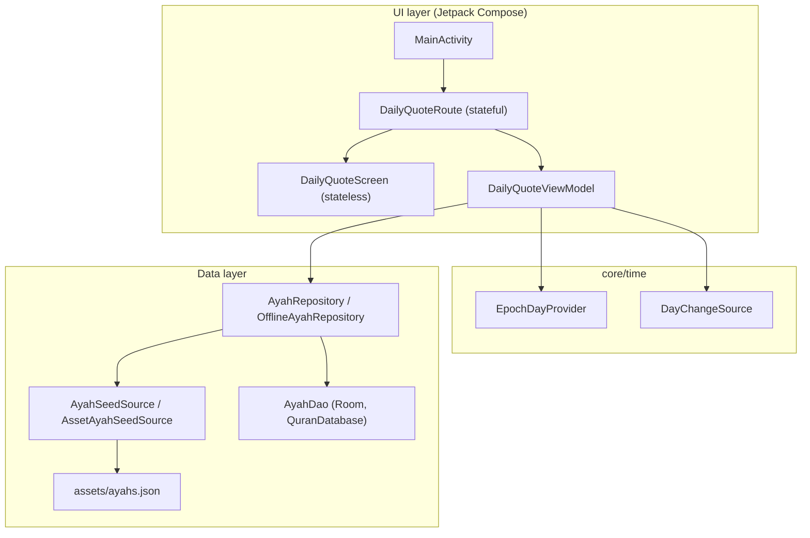
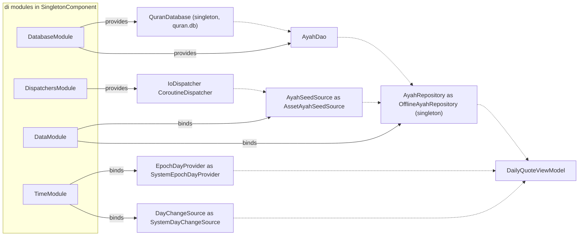

# Developer Architecture

The app follows MVVM, as described in the official Android app architecture guide. There is a UI layer and a data layer. A domain layer (use cases) is optional and only added when logic is shared between ViewModels or is too complex for one. The app has no use cases yet.

Why this shape? Each layer depends only on interfaces below it, and every dependency comes in through the constructor. That makes every class testable with simple fakes, which the 100% coverage rule relies on.

## The layers

This diagram shows the layers and which class depends on which.

## UI layer

- Compose only. There are no XML layouts or Fragments.
- Each screen has a ViewModel that exposes immutable state as a `StateFlow`. For the daily quote screen that is `StateFlow<DailyQuoteUiState>`, with the states `Loading`, `Success`, and `Error`.
- Each screen is split in two. The **route** (`DailyQuoteRoute`) gets the ViewModel with `hiltViewModel()`, collects state with `collectAsStateWithLifecycle()`, and wires up events. The **screen** (`DailyQuoteScreen`) only takes state and lambdas. That split is why the screen can have previews and simple UI tests.
- Composables hold no business logic. They show state and report user actions, such as the Retry tap.

## Data layer

- Repositories are the single source of truth and the only thing a ViewModel talks to for data.
- Room holds structured app data. DataStore will hold user settings when Settings is built. SharedPreferences is never used.
- `OfflineAyahRepository` is a `@Singleton`. It makes sure Room holds the current bundled ayahs, then reads the daily ayah from Room.

## Concurrency

Kotlin Coroutines and Flow are used everywhere:

- ViewModels launch work in `viewModelScope`.
- DAOs use `suspend` for one-shot work and would return `Flow` for observed queries.
- Dispatchers are injected, never hard-coded. `AssetAyahSeedSource` receives its dispatcher through the `@IoDispatcher` qualifier, so tests can swap it.

## Dependency injection with Hilt

Hilt is the only DI framework. `AlQuranQuotesApp` is `@HiltAndroidApp` and `MainActivity` is `@AndroidEntryPoint`. `DailyQuoteViewModel` is a `@HiltViewModel`. Never construct a ViewModel by hand in UI code.

All modules live in `app/src/main/java/shibbir/me/alquranquotes/di/` and are installed in `SingletonComponent`:

| Module | Provides |
| --- | --- |
| `DataModule` | `@Binds` `AyahRepository` to `OfflineAyahRepository`, and `AyahSeedSource` to `AssetAyahSeedSource`. |
| `DatabaseModule` | `@Provides` the singleton `QuranDatabase` (file `quran.db`) and its `AyahDao`. |
| `DispatchersModule` | `@Provides` the `@IoDispatcher` `CoroutineDispatcher` (`Dispatchers.IO`). |
| `TimeModule` | `@Binds` `EpochDayProvider` to `SystemEpochDayProvider`, and `DayChangeSource` to `SystemDayChangeSource`. |

The rule of thumb: bind interfaces with `@Binds`, and use `@Provides` for Room, DataStore, and dispatchers.

This graph shows what each module provides or binds (solid arrows) and where Hilt injects each object (dotted arrows).

`AssetAyahSeedSource` and `SystemDayChangeSource` also receive the `@ApplicationContext`, which Hilt supplies itself.

## From asset to screen

1. `MainActivity` sets the theme and shows `DailyQuoteRoute`.
2. Hilt creates `DailyQuoteViewModel`. On creation it reads today from `EpochDayProvider` and starts a load.
3. The ViewModel calls `AyahRepository.getDailyAyah(epochDay)`.
4. The first call in the process makes `OfflineAyahRepository` load `ayahs.json` through `AssetAyahSeedSource` and compare versions. If needed, it replaces the stored ayahs in Room.
5. `AyahDao.getAyahForDay` picks today's ayah in one transaction and returns an `AyahEntity`. The repository maps it to the `Ayah` model with `toAyah()`.
6. The ViewModel sets `DailyQuoteUiState.Success`, and the screen draws it. A missing ayah or an exception becomes `Error`, which shows a Retry button.

More detail: [Ayah Data](Developer-Ayah-Data.md) covers step 4, and [Daily Ayah Logic](Developer-Daily-Ayah-Logic.md) covers steps 2 and 5 and what happens when the day changes.

## Theming

`AlQuranQuotesTheme` in `ui/theme/Theme.kt` uses Material You dynamic color on Android 12 and newer (`useDynamicColor = true`). Older devices use the static schemes from `Color.kt`. Custom brand colors will not show on Android 12+ unless dynamic color is turned off.

[Back to the Developer Guide](Developer-Guide.md)
