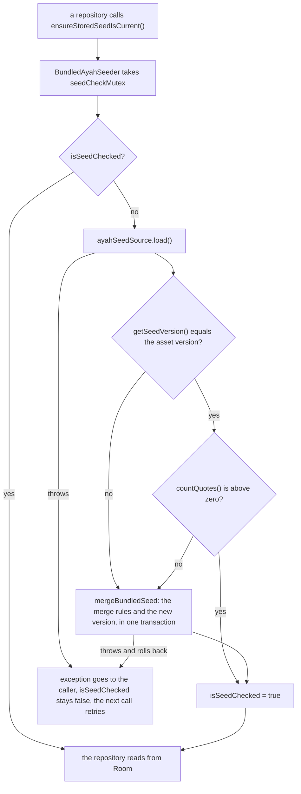
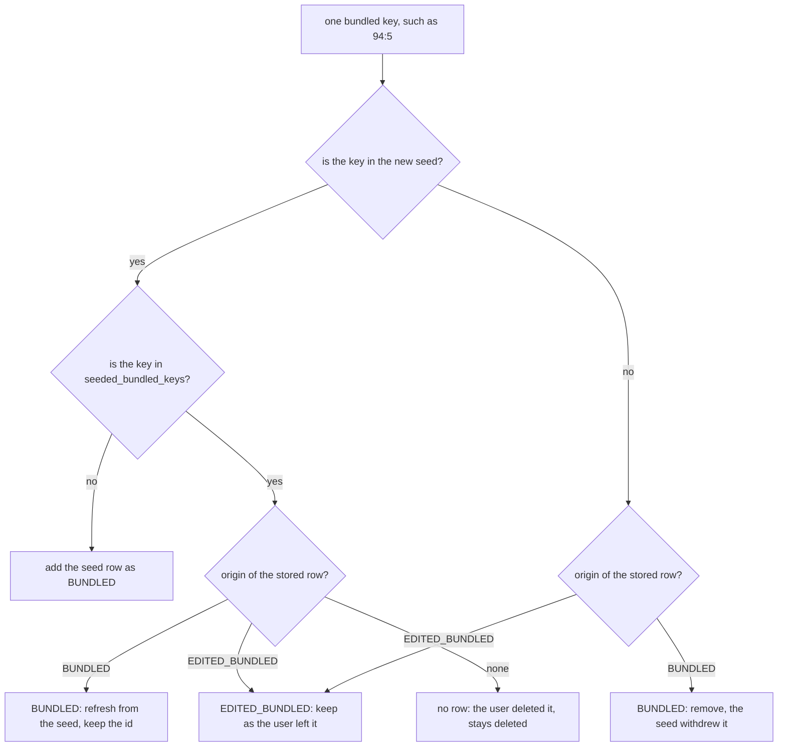
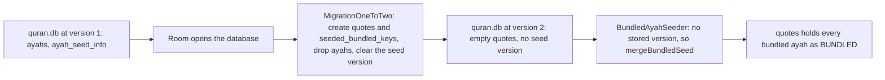
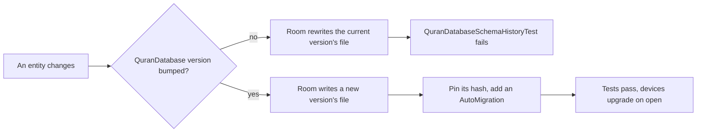

# Developer Ayah Data

All bundled ayahs are shipped inside the APK, and every quote, bundled or the user's own, is stored on the device. There is no network access. This page explains where the data comes from, how it is stored, how the bundled ayahs reach the database without undoing the user's changes, and how to change the data or the schema without breaking installed apps.

## One table for every quote

The Room database (`QuranDatabase`, file `quran.db`) is at version 2 and has three tables:

| Table | Entity | What it holds |
| --- | --- | --- |
| `quotes` | `QuoteEntity` | Every quote: the bundled ayahs (untouched or edited) and the quotes the user added. |
| `seeded_bundled_keys` | `SeededBundledKeyEntity` | Every bundled key a seed has ever stored, even after the user deleted that quote. |
| `ayah_seed_info` | `AyahSeedInfoEntity` | One row with the version of the last seed that was merged. |

Every row of `quotes` is real user data now, because the user can edit and delete any quote. So the app never deletes and rewrites the table. It merges the bundled seed into it with the rules below.

### The columns of `quotes`

- `id`: generated by Room (`autoGenerate = true`, so SQLite `AUTOINCREMENT`: ids only grow and are never reused). It is the `quoteId` the whole app uses to edit and delete a quote.
- `origin`: a `QuoteOrigin` (`model/QuoteOrigin.kt`):
  - `BUNDLED`: a bundled ayah the user has not changed.
  - `EDITED_BUNDLED`: a bundled ayah the user edited. A seed never overwrites it.
  - `USER`: a quote the user added.
- `type`: a `QuoteType` (`AYAH` or `FREE_TEXT`), which says which other columns are set:
  - `AYAH`: `surah_name`, `surah_number`, `ayah_number`, `arabic_text`, and `translation`.
  - `FREE_TEXT`: `free_text` and `reference` (the reference may be an empty string).
  - The columns of the other type are null.
- `bundled_key`: for example `94:5`. It is set only on rows a seed stored, and it never changes, even when the user edits the surah or ayah number. A unique index (`index_quotes_bundled_key`) keeps one row per key. User quotes have a null key, and null keys never clash.

### Mappings

The mapping functions next to the entity convert between rows and models:

- `QuoteEntity.kt`: `toQuote()` (a row to `Quote.AyahQuote` or `Quote.FreeTextQuote`, carrying `quoteId` and `origin`), `toQuoteDraft()` (a row to the `QuoteDraft` the editor loads), and `QuoteDraft.toQuoteEntity(origin)` (a new row with id 0, so Room generates one). A row missing a column its type needs throws when mapped, because that can only mean a bug.
- `QuoteEntityEdit.kt`: `editedWith(quoteDraft)`, used by `QuoteDao.updateQuote`. It keeps the id, the kind, and the bundled key, and moves the origin on with `afterEdit()` (`QuoteOriginAfterEdit.kt`). A draft of the other kind throws.
- `data/seed/BundledQuoteEntityMapping.kt`: `toBundledQuoteEntity()`, which turns a seed `Ayah` into a new `BUNDLED` row with the key `"$surahNumber:$ayahNumber"`. It stores the English surah name as `surah_name`. The Arabic surah name in the asset is not stored.

## The bundled asset

The file is `app/src/main/assets/ayahs.json`. It holds a curated set of 33 ayahs.

- **Arabic text:** Tanzil Project, `quran-simple` text.
- **English translation:** Saheeh International.
- Both were fetched through alquran.cloud.

The top level of the file has these fields:

- `version`: an integer that identifies this set of ayahs (currently 1). It decides when a seed is merged (see below).
- `source` and `translationLanguage`: information about where the text came from.
- `ayahs`: an array. Each entry has `surah`, `ayah`, `surahNameEnglish`, `surahNameArabic`, `arabic`, and `translation`.

The parser is `parseAyahSeedJson` in `app/src/main/java/shibbir/me/alquranquotes/data/seed/AyahJsonParser.kt`. It uses `org.json` and throws a `JSONException` if the file is malformed or a field is missing or has the wrong type. `AssetAyahSeedSource` reads the file and parses it on the injected IO dispatcher.

## Never retype Quran text

This is the most important rule on this page. **Never hand-edit or retype Quran text or translations.** A single wrong character changes the meaning of scripture. Always regenerate the asset from the original source.

The same rule covers samples outside the asset. `DailyQuotePreviewAyah.kt` (the sample used by Compose previews) is copied from the asset, and `DailyQuotePreviewAyahTest` fails if the two drift apart. Tests and the Quotes list previews use placeholder text such as `arabic-94-5`, so they never repeat Quran text.

What the user types into the editor is their own text, including when they edit a bundled ayah. The app stores it as typed (trimmed) and does not check it against any source.

## When a seed is merged

The asset is copied into Room, and the app reads quotes only from Room. The work happens in `BundledAyahSeeder` (`data/seed/BundledAyahSeeder.kt`), a `@Singleton` that both repositories call first: `OfflineDailyQuoteRepository.getDailyQuote` and `OfflineQuoteRepository.observeQuotes`.

1. The first time `ensureStoredSeedIsCurrent()` is called in a process, the seeder loads the asset through `AssetAyahSeedSource`.
2. It compares the asset `version` with `BundledAyahSeedDao.getSeedVersion()` (the single `ayah_seed_info` row).
3. If the versions differ, or `countQuotes()` is zero, it maps every seed ayah with `toBundledQuoteEntity()` and calls `BundledAyahSeedDao.mergeBundledSeed`. The merge runs in **one transaction** and records the new version at the end.
4. It marks the check as done, so later calls skip it.

This flowchart shows one `ensureStoredSeedIsCurrent()` call, including what happens when it fails.

A few details and the reasons behind them:

- **One seeder, shared.** Both repositories get the same singleton `BundledAyahSeeder`, so opening Home and then Quotes still loads the asset only once per process.
- **Once per process, guarded by a `Mutex`.** Two callers at the same time still load the asset only once.
- **Only an exact version match counts as current.** A newer or an older stored version is merged again.
- **An empty `quotes` table is never current.** It gets a merge, even at the same version. That merge only adds keys that no seed stored before, so a user who deleted every quote does not get the deleted ayahs back.
- **A failure is retried.** The check is marked done only after it succeeds. If the load or the merge fails, the transaction rolls back and the next call tries again.

## The merge rules

`mergeBundledSeed(seedQuoteEntities, seedVersion)` follows one principle: **the user's changes always win**.

- A seed ayah whose bundled key no seed ever stored is **added** as a new `BUNDLED` row.
- An untouched (`BUNDLED`) row that the seed still has is **refreshed** from the seed and keeps its id, so its place in the rotation stays the same.
- An `EDITED_BUNDLED` row is **kept** as the user left it, even when the seed drops its key.
- A bundled ayah the user **deleted is never added back**, because its key stays in `seeded_bundled_keys`.
- An untouched row whose key the seed no longer contains is **removed** (the ayah was withdrawn from the app).
- `USER` rows are **never touched**.
- At the end, every seed key is recorded in `seeded_bundled_keys` (keys already there are kept) and the seed version is upserted.

This flowchart shows what the merge does for one bundled key, either a key in the new seed or a key of a stored bundled row. User quotes have no key, so they never enter it.

Two more details:

- **Duplicate keys fail loudly.** A duplicate (surah, ayah) pair in the asset gives two rows with the same bundled key, the unique index rejects the insert, and the whole merge rolls back.
- **Deleting a quote keeps its key.** `QuoteDao.deleteQuote` only deletes the row. The key in `seeded_bundled_keys` stays, which is what keeps a deleted bundled ayah deleted.

The tests: `BundledAyahSeederMergeTest` covers each rule on the JVM (`firstSeedAddsEveryBundledAyahAsUntouched`, `deletedBundledAyahIsNotAddedBack`, `newerSeedAddsTheBundledAyahsTheUserNeverHad`, `newerSeedRefreshesUntouchedBundledAyahsKeepingTheirIds`, `newerSeedNeverOverwritesAnEditedBundledAyah`, `newerSeedRemovesUntouchedBundledAyahsItNoLongerContains`, `newerSeedKeepsAnEditedBundledAyahItNoLongerContains`, and `newerSeedNeverTouchesTheUserQuotes`). It runs the real DAO body through `FakeBundledAyahSeedDao`. On a device, `BundledAyahSeedDaoTest` checks the same on a real database, including `failedMergeRollsBackToThePreviousQuotesAndVersion`.

## How to update the ayah data safely

1. Create a branch (see [Contributing](Developer-Contributing.md)) and agree on the change with the project owner first.
2. Regenerate `ayahs.json` from the original sources (Tanzil `quran-simple` and Saheeh International). Do not type or paste text by hand.
3. **Bump `version`** to a new integer. If you forget, installed apps never merge the new seed, because the stored version still matches.
4. If the ayah used by `DailyQuotePreviewAyah.kt` changed, copy it again from the regenerated asset.
5. Run the unit tests: `./gradlew testDebugUnitTest`. `AyahJsonParserTest.bundledAssetIsValid` checks the real asset: it parses, the version is at least 1, there are no duplicate (surah, ayah) pairs, surah numbers are 1 to 114, and no field is blank.
6. Run the device tests: `./gradlew connectedDebugAndroidTest`. `OfflineDailyQuoteRepositoryDeviceTest`, `OfflineQuoteRepositoryDeviceTest`, and `MainActivityTest` load the real asset on a device.
7. Update the ayah count in the `README.md` feature tracker and in these docs if it changed.

Changing the ayahs is not a schema change. It only needs the `version` bump. The merge rules keep every edit and delete the user made.

## Schema version 2 and its migration

Room exports its schema to `app/schemas/shibbir.me.alquranquotes.data.local.QuranDatabase/` through the `androidx.room` Gradle plugin. There is one file per version. Commit those files.

- `1.json`: the version on `main` before this change. It has `ayahs` (keyed by `surah_number` and `ayah_number`) and `ayah_seed_info`.
- `2.json`: the current version. It has `quotes`, `seeded_bundled_keys`, and `ayah_seed_info`.

The step from 1 to 2 uses a hand-written migration, `MigrationOneToTwo` (`data/local/MigrationOneToTwo.kt`). `DatabaseModule` registers it with `addMigrations(MigrationOneToTwo)`. It runs five statements:

1. Create `quotes`.
2. Create the unique index on `bundled_key`.
3. Create `seeded_bundled_keys`.
4. Drop `ayahs`.
5. Delete the row in `ayah_seed_info`, so no seed version is stored.

It does not copy the version 1 rows. They were only re-seedable bundled data that the user could not change. With no stored seed version, the seeder merges the asset on the next start and stores every bundled ayah in `quotes`, with its bundled key.

This flowchart shows what happens when an installed version 1 database is opened by the new app.

### Why an auto migration was not enough

A Room `AutoMigration` writes the migration from the difference between two exported schemas. That works when a change only adds tables or columns. This change also drops a table and clears the stored seed version so the seeder runs again. Those are decisions about data, not schema differences, so an auto migration would need an extra spec class and a callback anyway. A plain `Migration` keeps every statement in one short file that a unit test can check line by line.

### The migration tests

- `MigrationOneToTwoTest` (JVM): runs `MigrationOneToTwo.migrate` on `SqlRecordingDatabase` and checks the exact statements, in order, and the start and end versions.
- `QuranDatabaseMigrationTest.migrationFromOneToTwoCreatesTheQuoteTablesAndClearsTheSeedVersion` (device): uses `MigrationTestHelper` from `androidx.room:room-testing`. It creates a version 1 database from `1.json` with one ayah and a seed version, runs the migration with validation against `2.json`, and checks that `ayahs` is gone and that `quotes`, `seeded_bundled_keys`, and `ayah_seed_info` are empty.

Rules from now on, because the database holds user data:

- Every schema change needs a **version bump** and a **migration**, tested against the exported schemas. Prefer a Room `@AutoMigration`, listed in `@Database(autoMigrations = [...])` on `QuranDatabase`, for example `AutoMigration(from = 2, to = 3)`. Room writes it from the two exported schemas. Hand-write a `Migration` only when data moves, like `MigrationOneToTwo`.
- **A version's schema never changes once its file exists**, even on a branch that is not merged yet. Any device that already has that version would crash on open. To change the schema again, bump the version again. An extra version costs one more `@AutoMigration` line.
- **Never use a destructive fallback.** It would delete the user's quotes and edits.

### The schema history check

`QuranDatabaseSchemaHistoryTest` (`app/src/test/.../data/local/`) makes the version bump impossible to forget. It pins the `identityHash` of every exported schema, the fingerprint Room compares when it opens a database, and it fails when:

- a pinned hash changed, which means an entity changed without a version bump. The message says to revert the change to that version's file, bump the version, and add a migration.
- a schema file exists for the version after the last pinned one. The message says to pin its hash and add its migration.

The test reads `app/schemas` from disk. Room writes the schema of the compiled entities there in its `copyRoomSchemas` task, so the `tasks.withType<Test>()` block in `app/build.gradle.kts` runs that task first and passes the folder as the `roomSchemaDirectory` system property. Run unit tests through Gradle (Android Studio does this by default).

This flowchart shows what happens to a schema change.

## Backup includes the database

The database is **included** in Android backup and device transfer. `app/src/main/res/xml/backup_rules.xml` (Android 11 and lower) is an empty `full-backup-content`, and `app/src/main/res/xml/data_extraction_rules.xml` (Android 12 and higher) has empty `cloud-backup` and `device-transfer` blocks, so everything is included.

The reason: `quotes` and `seeded_bundled_keys` hold the quotes the user added and the bundled ayahs they edited or deleted, which cannot be rebuilt from the APK. A restored database may carry an older seed version. That is fine: on the next start the version check merges the current seed, and the merge rules keep every change the user made.

[Back to the Developer Guide](Developer-Guide.md)
