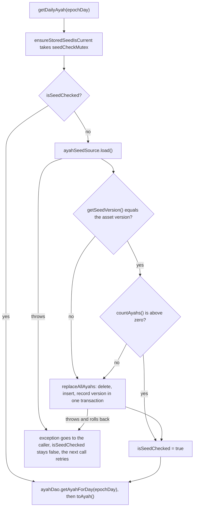

# Developer Ayah Data

All ayahs the app can show are bundled inside the APK. There is no network access. This page explains where the data comes from, how it reaches the database, and how to change it without breaking installed apps.

## The bundled asset

The file is `app/src/main/assets/ayahs.json`. It holds a curated set of 33 ayahs.

- **Arabic text:** Tanzil Project, `quran-simple` text.
- **English translation:** Saheeh International.
- Both were fetched through alquran.cloud.

The top level of the file has these fields:

- `version`: an integer that identifies this set of ayahs. It drives reseeding (see below).
- `source` and `translationLanguage`: information about where the text came from.
- `ayahs`: an array. Each entry has `surah`, `ayah`, `surahNameEnglish`, `surahNameArabic`, `arabic`, and `translation`.

The parser is `parseAyahSeedJson` in `app/src/main/java/shibbir/me/alquranquotes/data/seed/AyahJsonParser.kt`. It uses `org.json` and throws a `JSONException` if the file is malformed or a field is missing or has the wrong type.

## Never retype Quran text

This is the most important rule on this page. **Never hand-edit or retype Quran text or translations.** A single wrong character changes the meaning of scripture. Always regenerate the asset from the original source.

The same rule covers samples outside the asset. `DailyQuotePreviewAyah.kt` (the sample used by Compose previews) is copied from the asset, and `DailyQuotePreviewAyahTest` fails if the two drift apart.

## How seeding works

The asset is copied into Room, and the app reads ayahs only from Room. The work happens in `OfflineAyahRepository`:

1. The first time `getDailyAyah` is called in a process, the repository loads the asset through `AssetAyahSeedSource`. The file read and parsing run on the injected IO dispatcher.
2. It compares the asset `version` with the version stored in the `ayah_seed_info` table (a single row, see `AyahSeedInfoEntity`).
3. If the versions differ, or the `ayahs` table is empty, it calls `AyahDao.replaceAllAyahs`. That deletes every stored ayah, inserts the new ones, and records the new version, all in **one transaction**.
4. It marks the check as done, so later calls skip it.

This flowchart shows one `getDailyAyah` call, including what happens when the seed check fails.

A few details and the reasons behind them:

- **Once per process, guarded by a `Mutex`.** Two callers at the same time still load the asset only once.
- **Only an exact version match counts as current.** A newer or an older stored version is replaced. This keeps the database equal to whatever the installed APK ships.
- **An empty table is never current.** A broken or cleared table heals itself on the next start.
- **A failure is retried.** The check is marked done only after it succeeds. If the load or the replace fails, the old ayahs stay (the transaction rolls back) and the next call tries again.
- **Duplicate keys fail loudly.** The primary key of `ayahs` is (`surah_number`, `ayah_number`). A duplicate in the asset makes the insert fail, which rolls back the whole replace.

## How to update the ayah data safely

1. Create a branch (see [Contributing](Developer-Contributing.md)) and agree on the change with the project owner first.
2. Regenerate `ayahs.json` from the original sources (Tanzil `quran-simple` and Saheeh International). Do not type or paste text by hand.
3. **Bump `version`** to a new integer. If you forget, installed apps keep their old rows forever, because the stored version still matches.
4. If the ayah used by `DailyQuotePreviewAyah.kt` changed, copy it again from the regenerated asset.
5. Run the unit tests: `./gradlew testDebugUnitTest`. `AyahJsonParserTest.bundledAssetIsValid` checks the real asset: it parses, the version is at least 1, there are no duplicate (surah, ayah) pairs, surah numbers are 1 to 114, and no field is blank.
6. Run the device tests: `./gradlew connectedDebugAndroidTest`. `OfflineAyahRepositoryDeviceTest` and `MainActivityTest` load the real asset on a device.
7. Update the ayah count in the `README.md` feature tracker and in these docs if it changed.

## Schema and migrations

Room exports its schema to `app/schemas/` through the `androidx.room` Gradle plugin. Commit those files. The database (`QuranDatabase`) is at version 1 and the app has never been released.

- **Before the first release:** a schema change can stay at version 1. Developers uninstall the old build (see [Setup](Developer-Setup.md)).
- **After the first release:** every schema change needs a version bump and a `Migration` tested against the exported schema. Never use a destructive fallback once the database holds user data.

Note that changing the ayahs is not a schema change. It only needs the `version` bump in the asset.

## Backup exclusion

The database is excluded from Android backup and device transfer in `app/src/main/res/xml/backup_rules.xml` and `app/src/main/res/xml/data_extraction_rules.xml`. The reason: it only holds content that the app can re-seed from the asset, so backing it up would waste the user's quota.

This must be revisited when the database starts holding user data, for example Favorites.

[Back to the Developer Guide](Developer-Guide.md)
