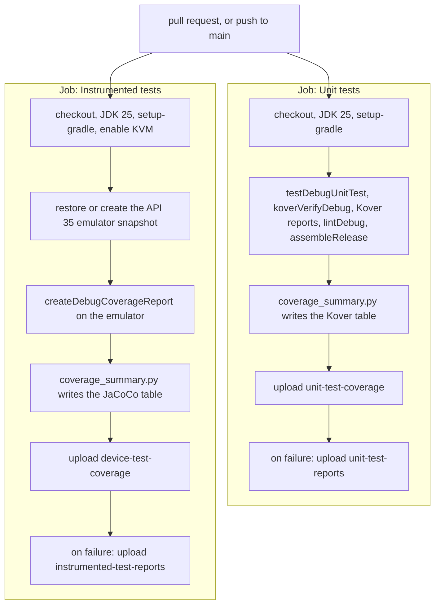
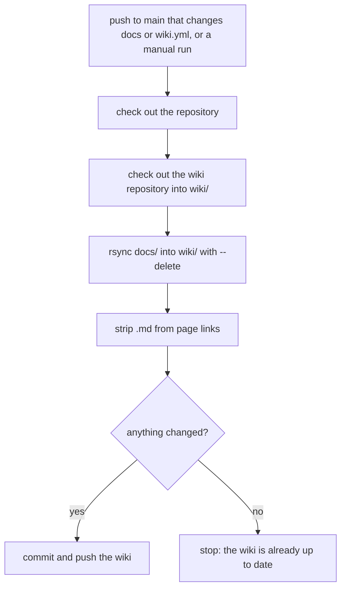

# Developer CI and Release

GitHub Actions checks every change before it can reach `main`. This page explains the two workflows, what each step does, where to find the reports, and how the release build is set up.

## The test workflow

`.github/workflows/tests.yml` runs on every pull request and on every push to `main`. It has two jobs that run in parallel. Both must be green before a pull request can merge.

Both jobs start the same way: check out the code, install JDK 25 (Temurin), and set up Gradle with caching.

This flowchart shows the steps of both jobs. The summary and coverage upload steps run on every run, and the raw report uploads run only when the job fails.



### Job 1: Unit tests

One Gradle call runs all the JVM checks:

```bash
./gradlew --continue testDebugUnitTest koverVerifyDebug koverXmlReportDebug koverHtmlReportDebug lintDebug assembleRelease
```

- `testDebugUnitTest`: the JVM unit tests.
- `koverVerifyDebug`: fails if unit coverage is below 100% for lines or branches.
- `koverXmlReportDebug` and `koverHtmlReportDebug`: write the coverage reports.
- `lintDebug`: Android lint.
- `assembleRelease`: proves the R8 release build still works.

`--continue` makes Gradle run every task even if one fails, so a single run shows you all the problems at once.

### Job 2: Instrumented tests

This job runs the device tests on an API 35 emulator (`google_apis`, `x86_64`):

1. Enable KVM, so the emulator runs with hardware acceleration.
2. Restore the emulator snapshot from the cache, or create it if there is no cache hit.
3. Boot the emulator from the snapshot and run `./gradlew createDebugCoverageReport -PdeviceTestCoverage`. That runs every instrumented test and writes the JaCoCo device coverage report.

## Reports and summaries

Both jobs write a coverage table to the **run summary** page of the GitHub Actions run, using `.github/scripts/coverage_summary.py`. The script reads the JaCoCo-format XML report (Kover writes the same format) and leaves generated classes out of the totals, so the numbers describe hand-written code.

Both jobs also **upload their HTML coverage reports as artifacts on every run**, pass or fail:

- `unit-test-coverage`: the Kover report. Open `htmlDebug/index.html` inside it.
- `device-test-coverage`: the JaCoCo report. Open `debug/connected/index.html` inside it.

When a job fails, it also uploads the raw test results: `unit-test-reports` (test, Kover, and lint reports) or `instrumented-test-reports`. Download artifacts from the bottom of the run's summary page.

See [Testing and Coverage](Developer-Testing-And-Coverage.md) for how to read the reports.

## Emulator cache

Booting a fresh emulator is slow. The job caches the emulator's AVD folder under the key `avd-v1-api-35-google_apis-x86_64`. On a cache hit it boots straight from the saved snapshot. The test run uses `-no-snapshot-save`, so tests never change the cached snapshot.

If the emulator image or settings change, bump the leading version in the key (for example `avd-v2-...`) to force a fresh snapshot.

## Run cancellation

A newer push to a pull request cancels the older, still running run for that pull request. Runs on `main` are never cancelled while in progress, although a queued `main` run can be replaced by a newer queued one.

## The wiki workflow

`.github/workflows/wiki.yml` publishes the `docs/` folder to the GitHub wiki. It runs on every push to `main` that changes `docs/` (or the workflow file itself), and it can also be started by hand.

It checks out the wiki's git repository, copies `docs/` over it (pages removed from `docs/` are removed from the wiki too), and strips `.md` from page links. That is why pages link to each other as `Page-Name.md` in the repository: the links work on GitHub and, after stripping, in the wiki.

This flowchart shows the steps of the wiki workflow.



Rules that follow from this:

- Never edit the wiki directly. Edit `docs/` and merge a pull request.
- Name pages `User-*.md` or `Developer-*.md`.
- The wiki must already have at least one page, created once in the GitHub UI, so its git repository exists.

## Release build and R8

The release build type turns on R8 with `optimization { enable = true }` in `app/build.gradle.kts`. That covers code shrinking, obfuscation, and resource shrinking.

- Keep rules go in `app/src/main/keepRules/`. AGP merges every `*.keep` file there. There is no `proguard-rules.pro`.
- Hilt, Room, and Compose ship their own keep rules, so `rules.keep` has none yet.
- After adding a library, check that `./gradlew assembleRelease` still builds. CI checks this on every pull request.

The app has not been released yet. Versioning (`versionCode` and `versionName`) is set in `defaultConfig` in `app/build.gradle.kts`.

[Back to the Developer Guide](Developer-Guide.md)
