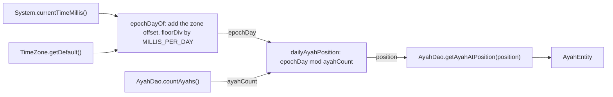
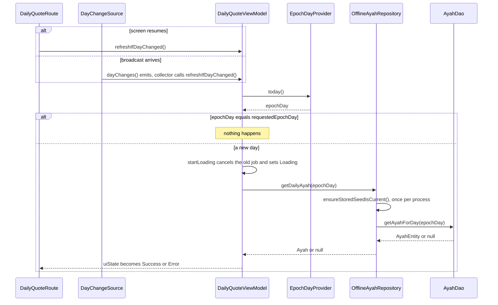
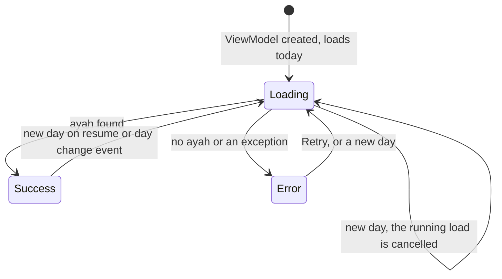

# Developer Daily Ayah Logic

The app shows one ayah per day. Everyone in the same time zone with the same app version sees the same ayah on the same date, and the screen moves to the next ayah after local midnight. This page explains how.

## Step 1: what day is it?

A "day" in this app is an **epoch day**: the number of whole local days since 1970-01-01. It is a plain `Long`, which is easy to store, compare, and test.

- `EpochDayProvider` (`core/time/EpochDayProvider.kt`) is a one-method interface: `today()`.
- `SystemEpochDayProvider` reads the device clock and the device's current time zone on every call.
- The math is the pure function `epochDayOf` in `core/time/EpochDay.kt`.

`epochDayOf` works like this. System time counts milliseconds in UTC. The function adds the time zone's offset at that instant (which includes daylight saving time) to get local wall-clock milliseconds. Then it divides by the length of a day with `Math.floorDiv`. Floor division keeps times before 1970 on negative days, instead of rounding them toward zero.

Why a local day and not a UTC day? The user expects the ayah to change at their own midnight, not at midnight in London.

The time zone is read again on every call, so travelling or changing the zone setting takes effect right away. `SystemEpochDayProviderTest` checks this.

## Step 2: which ayah belongs to that day?

The ayahs in Room are ordered by surah number, then ayah number. The daily ayah is the one at position `epochDay mod ayahCount` in that order.

- The function is `dailyAyahPosition` in `data/local/DailyAyahPosition.kt`. It uses Kotlin's `mod`, which is never negative, so days before 1970 still give a valid position. It rejects an `ayahCount` that is not positive.
- `AyahDao.getAyahForDay` counts the ayahs, computes the position, and reads the ayah at that position with `LIMIT 1 OFFSET`. It does this in **one transaction**, so a reseed in between cannot make the count and the lookup disagree. If the table is empty it returns null.

This flowchart shows how the device clock becomes a stored ayah.

The clock, zone, and `epochDayOf` steps run in `SystemEpochDayProvider.today()`. The count, position, and lookup run inside `AyahDao.getAyahForDay`, which returns null before computing a position when the count is zero.

The result: consecutive days give consecutive ayahs, and the list starts again after `ayahCount` days. With 33 ayahs, the cycle is 33 days long. Adding or removing ayahs shifts which ayah falls on which date. That is expected.

## Step 3: noticing that the day changed

`DailyQuoteViewModel` remembers the epoch day of the most recent load it started (`requestedEpochDay`). Its public function `refreshIfDayChanged()` reads today again and starts a new load only if the day differs. Nothing happens on the same day.

Two things call `refreshIfDayChanged()`:

1. **Day change events.** `DayChangeSource` is a `Flow<Unit>`. `SystemDayChangeSource` feeds it from three system broadcasts: date changed, time changed, and time zone changed. The ViewModel collects it for its whole life, so a screen left open past midnight updates by itself. An emission only means "check again"; the day may be the same. The broadcast receiver is registered while the flow is collected and unregistered when collection stops.
2. **Resume.** `DailyQuoteRoute` uses `LifecycleResumeEffect` to call `refreshIfDayChanged()` every time the screen resumes. Broadcasts can be missed or delayed while the app is in the background, so the resume check is the safety net.

The Retry button calls `loadDailyQuote()`, which always loads today, even on the same day. It also updates `requestedEpochDay`, so a later day check compares against the day of that retry.

## Step 4: only the newest load wins

Every load goes through one private function that:

1. Cancels the previous load job, if any.
2. Records the new `requestedEpochDay`.
3. Sets the state to `Loading`.
4. Launches the new load in `viewModelScope`.

Cancelling the old job matters. Without it, a slow load for yesterday could finish after the load for today and overwrite the screen with the wrong ayah.

There is one more subtle case. The load catches exceptions and turns them into `Error`. A `CancellationException` is also an exception, and it can come from inside the repository (for example a timeout) while the load itself is still active. So the catch block calls `currentCoroutineContext().ensureActive()`. If this load was cancelled, that call rethrows and nothing is written. If the load is still active, the error is shown as `Error`.

## The refresh path at a glance

This sequence shows what happens after a resume or a day change event, from the route down to Room.

## Screen states

This state diagram shows how `DailyQuoteUiState` moves between its three states. Every move into `Loading` goes through `startLoading`, which cancels the previous load first.

## Tests to read

- `EpochDayTest` and `SystemEpochDayProviderTest`: day math, offsets, daylight saving, negative days.
- `DailyAyahPositionTest`: wrapping and invalid counts.
- `DailyQuoteViewModelDayChangeTest`: resume checks and day change events.
- `DailyQuoteViewModelCancelledLoadTest`: a cancelled load never overwrites a newer one. It uses a `StandardTestDispatcher` on purpose, because the unconfined dispatcher resumes the old load too early to show the bug.
- Device tests: `SystemDayChangeSourceTest` (receiver registration and emissions), `AyahDaoTest.getAyahForDayPicksTheDailyPositionInSurahAndAyahOrder`, and `DailyQuoteRouteTest.resumingOnANewDayShowsTheNewDaysAyah`.

[Back to the Developer Guide](Developer-Guide.md)
