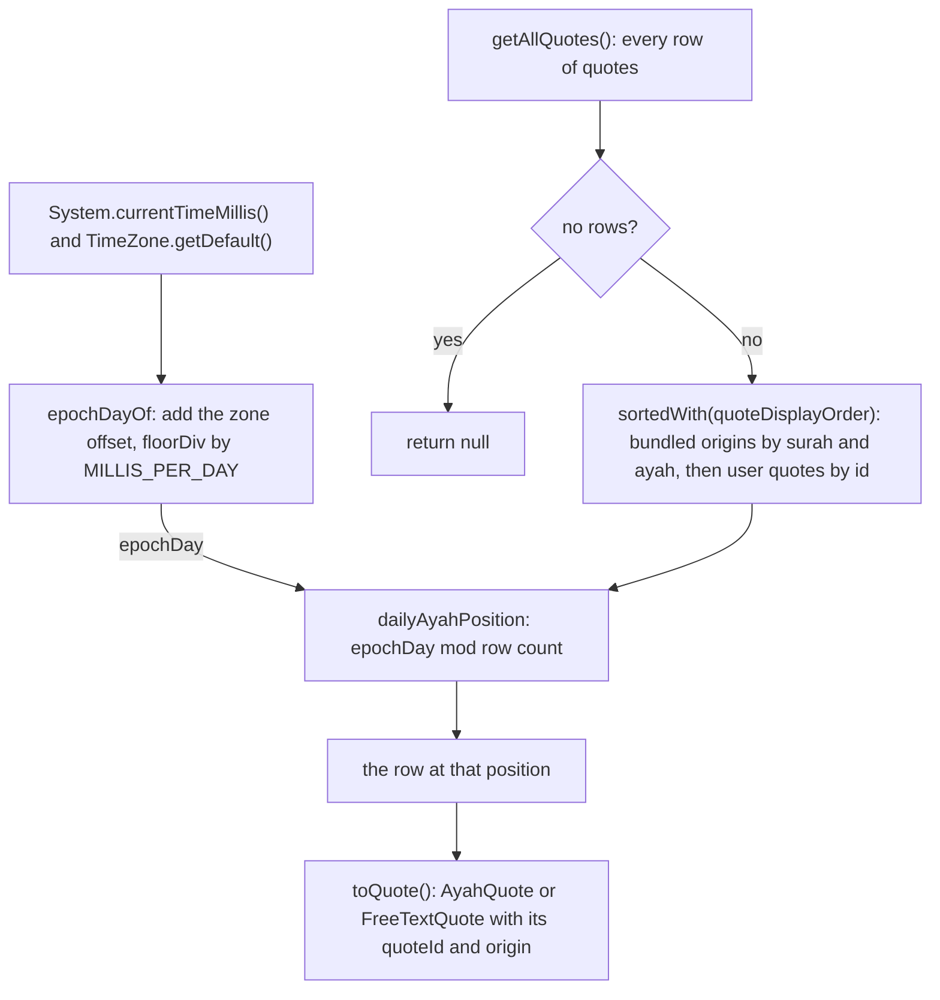
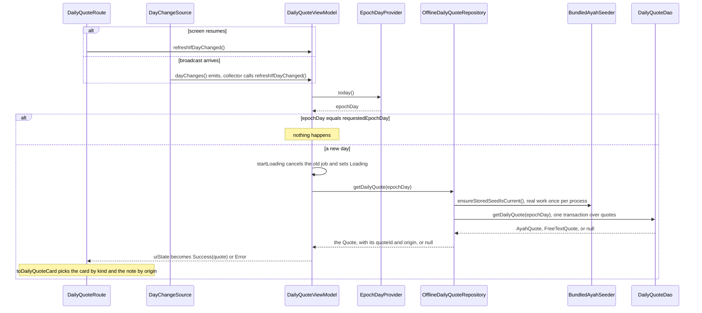
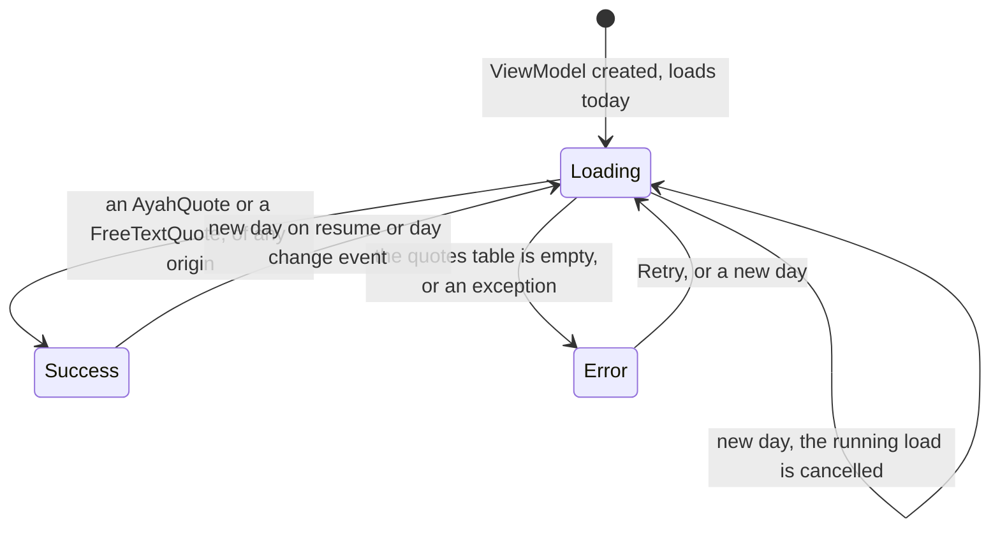

# Developer Daily Ayah Logic

The Home tab shows one quote per day. The daily rotation covers the bundled ayahs first (edited or not) and then the quotes the user added. On the same date, everyone in the same time zone with the same app version who has not added, edited, or deleted a quote sees the same ayah, and the screen moves to the next quote after local midnight. This page explains how.

## Step 1: what day is it?

A "day" in this app is an **epoch day**: the number of whole local days since 1970-01-01. It is a plain `Long`, which is easy to store, compare, and test.

- `EpochDayProvider` (`core/time/EpochDayProvider.kt`) is a one-method interface: `today()`.
- `SystemEpochDayProvider` reads the device clock and the device's current time zone on every call.
- The math is the pure function `epochDayOf` in `core/time/EpochDay.kt`.

`epochDayOf` works like this. System time counts milliseconds in UTC. The function adds the time zone's offset at that instant (which includes daylight saving time) to get local wall-clock milliseconds. Then it divides by the length of a day with `Math.floorDiv`. Floor division keeps times before 1970 on negative days, instead of rounding them toward zero.

Why a local day and not a UTC day? The user expects the quote to change at their own midnight, not at midnight in London.

The time zone is read again on every call, so travelling or changing the zone setting takes effect right away. `SystemEpochDayProviderTest` checks this.

## Step 2: which quote belongs to that day?

Every quote lives in the one `quotes` table (see [Ayah Data](Developer-Ayah-Data.md)). The rotation walks them in `quoteDisplayOrder` (`data/local/QuoteDisplayOrder.kt`), the same order as the Quotes list:

1. The bundled-origin quotes, both `BUNDLED` and `EDITED_BUNDLED`, by surah number, then ayah number. An edited bundled ayah sorts by its current numbers, so if the user changes its numbers it moves to its new place.
2. The `USER` quotes by `id`, so oldest first. Their surah and ayah numbers are ignored, so a user ayah never slips in between the bundled ones.
3. Rows that tie keep the lower `id` first.

The daily quote is the one at position `epochDay mod quoteCount` in that list, where `quoteCount` is the number of rows in `quotes`.

- The position function is `dailyAyahPosition` in `data/local/DailyAyahPosition.kt`. It uses Kotlin's `mod`, which is never negative, so days before 1970 still give a valid position. It rejects a count that is not positive.
- `DailyQuoteDao.getDailyQuote` (`data/local/DailyQuoteDao.kt`) does the lookup. It reads every row with one query (`getAllQuotes()`), returns null when there are none, sorts them with `quoteDisplayOrder`, picks the row at the position, and maps it with `toQuote()`.
- All of that runs in **one `@Transaction`**. Even a result too large for one cursor window is one consistent snapshot, so a seed merge or a user edit cannot change it halfway through.

This flowchart shows how the device clock becomes a quote.

The clock and `epochDayOf` steps run in `SystemEpochDayProvider.today()`. Everything from `getAllQuotes()` down runs inside `DailyQuoteDao.getDailyQuote`, in one transaction.

The result: consecutive days give consecutive quotes, and the list starts again after `quoteCount` days. With the 33 bundled ayahs and no changes, the cycle is 33 days long. Adding or deleting any quote, or a seed that adds or withdraws ayahs, changes the count and so shifts which quote falls on which date. Editing a quote keeps its id, so it keeps its place, unless the user changes the numbers of a bundled ayah. That is expected.

`OfflineDailyQuoteRepository.getDailyQuote` first calls `BundledAyahSeeder.ensureStoredSeedIsCurrent()` (see [Ayah Data](Developer-Ayah-Data.md)) and then asks `DailyQuoteDao`.

## Quote kinds and origins on Home

`DailyQuoteUiState.Success` holds a `Quote`. The screen turns it into a `DailyQuoteCard` with `toDailyQuoteCard()` (`feature/dailyquote/DailyQuoteCard.kt`), a plain mapping that unit tests check (`DailyQuoteCardTest`). `DailyQuoteCardContent` then draws the card.

The kind picks the card, and the origin picks a small note under the title, through `QuoteOrigin.toDailyQuoteOriginNote()` (`DailyQuoteOriginNote.kt`, checked by `DailyQuoteOriginNoteTest`):

| `Quote` | `DailyQuoteCard` | What the card shows |
| --- | --- | --- |
| `Quote.AyahQuote` | `AyahCard` | "Ayah of the day", the Arabic text, the translation, and the reference such as "Ash-Sharh 94:5". |
| `Quote.FreeTextQuote` | `FreeTextCard` | "Quote of the day", the text, and the reference. A blank reference becomes null and is left out. |

| `QuoteOrigin` | `originNote` | Label |
| --- | --- | --- |
| `BUNDLED` | null | none |
| `EDITED_BUNDLED` | `DailyQuoteOriginNote.EDITED` | "Edited" |
| `USER` | `DailyQuoteOriginNote.YOUR_QUOTE` | "Your quote" |

The Arabic text goes through `rememberArabicAnnotatedText` (`ui/text/ArabicAnnotatedText.kt`), which marks it as Arabic so TalkBack reads it with an Arabic voice. The card sits in a scrolling column under the large top app bar, so long quotes stay readable with large fonts and the bar collapses (see Native Material 3 UI in [Architecture](Developer-Architecture.md)).

## Step 3: noticing that the day changed

`DailyQuoteViewModel` remembers the epoch day of the most recent load it started (`requestedEpochDay`). Its public function `refreshIfDayChanged()` reads today again and starts a new load only if the day differs. Nothing happens on the same day.

Two things call `refreshIfDayChanged()`:

1. **Day change events.** `DayChangeSource` is a `Flow<Unit>`. `SystemDayChangeSource` feeds it from three system broadcasts: date changed, time changed, and time zone changed. The ViewModel collects it for its whole life, so a screen left open past midnight updates by itself. An emission only means "check again"; the day may be the same. The broadcast receiver is registered while the flow is collected and unregistered when collection stops.
2. **Resume.** `DailyQuoteRoute` uses `LifecycleResumeEffect` to call `refreshIfDayChanged()` every time the screen resumes, including when the user comes back to the Home tab. Broadcasts can be missed or delayed while the app is in the background, so the resume check is the safety net.

The Retry button calls `loadDailyQuote()`, which always loads today, even on the same day. It also updates `requestedEpochDay`, so a later day check compares against the day of that retry.

Home does not observe the `quotes` table. After the user adds, edits, or deletes a quote, Home keeps the quote it already loaded until its next load (a new day, Retry, or a new process).

## Step 4: only the newest load wins

Every load goes through one private function, `startLoading`, that:

1. Cancels the previous load job, if any.
2. Records the new `requestedEpochDay`.
3. Sets the state to `Loading`.
4. Launches the new load in `viewModelScope`.

Cancelling the old job matters. Without it, a slow load for yesterday could finish after the load for today and overwrite the screen with the wrong quote.

There is one more subtle case. The load catches exceptions and turns them into `Error`. A `CancellationException` is also an exception, and it can come from inside the repository (for example a timeout) while the load itself is still active. So the catch block calls `currentCoroutineContext().ensureActive()`. If this load was cancelled, that call rethrows and nothing is written. If the load is still active, the error is shown as `Error`.

## The refresh path at a glance

This sequence shows what happens after a resume or a day change event, from the route down to Room.

## Screen states

This state diagram shows how `DailyQuoteUiState` moves between its three states. Every move into `Loading` goes through `startLoading`, which cancels the previous load first.

## Tests to read

- `EpochDayTest` and `SystemEpochDayProviderTest`: day math, offsets, daylight saving, negative days.
- `DailyAyahPositionTest`: wrapping and invalid counts.
- `QuoteDisplayOrderTest`: bundled ayahs by surah then ayah number, user quotes after every bundled ayah by id whatever their numbers, and edited bundled ayahs by their current numbers with ties by id.
- `OfflineDailyQuoteRepositoryTest`: no quotes at all, seeding first, the bundled ayahs in surah and ayah order, then user quotes, wrapping around. It runs the real `DailyQuoteDao.getDailyQuote` body through `FakeDailyQuoteDao`.
- `DailyQuoteCardTest` and `DailyQuoteOriginNoteTest`: the card and the note for each kind and origin.
- `DailyQuoteViewModelTest`: loading, the user's ayah and free text, errors, retry, and the newest load winning.
- `DailyQuoteViewModelDayChangeTest`: resume checks and day change events.
- `DailyQuoteViewModelCancelledLoadTest`: a cancelled load never overwrites a newer one. It uses a `StandardTestDispatcher` on purpose, because the unconfined dispatcher resumes the old load too early to show the bug.
- Device tests: `DailyQuoteDaoTest` (the rotation on a real database), `OfflineDailyQuoteRepositoryDeviceTest` (every day of the cycle, and `theDayAfterTheLastBundledAyahGivesTheUserQuote`), `SystemDayChangeSourceTest` (receiver registration and emissions), `DailyQuoteScreenQuoteTest` (each kind of card, the "Edited" and "Your quote" notes), `DailyQuoteScreenTest`, and `DailyQuoteRouteTest.resumingOnANewDayShowsTheNewDaysQuote`.

[Back to the Developer Guide](Developer-Guide.md)
