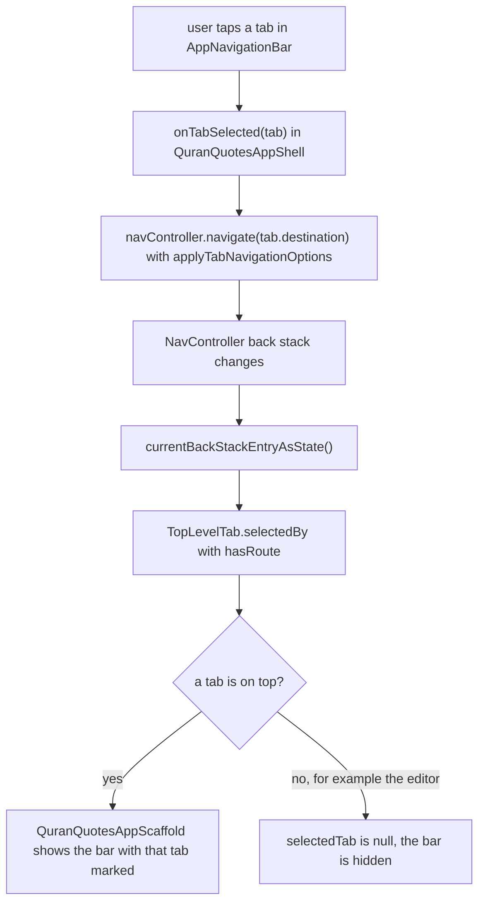

# Developer Navigation

The app has a Material 3 bottom navigation bar with three tabs (Home, Quotes, Settings) and one full screen page, the quote editor. The navigation code lives in `app/src/main/java/shibbir/me/alquranquotes/navigation/`, and the top app bars in `ui/components/`. This page explains the routes, the tabs, how switching tabs works, when the bottom bar shows, the top app bars, window insets, and screen transitions.

## Libraries

- `androidx.navigation:navigation-compose` (`libs.androidx.navigation.compose`): the `NavHost` and `NavController`.
- The Kotlin serialization plugin (`libs.plugins.kotlin.serialization`) and `kotlinx-serialization-core` (`libs.kotlinx.serialization.core`): type-safe routes are `@Serializable` classes, so no route strings are typed by hand.
- `androidx.compose.material:material-icons-core` (`libs.androidx.compose.material.icons.core`): the small built-in icon set, for the tab icons and the Add, Edit, Delete, and Back buttons. The large `material-icons-extended` is not used.

## Routes

`AppDestination` is a `@Serializable` sealed interface. Each subtype is one destination:

| Route | Kind | Shows |
| --- | --- | --- |
| `AppDestination.Home` | tab, start destination | `DailyQuoteRoute` |
| `AppDestination.Quotes` | tab | `QuotesRoute` |
| `AppDestination.Settings` | tab | `SettingsScreen` |
| `AppDestination.AddQuote` | full screen | `QuoteEditorRoute` |
| `AppDestination.EditQuote(quoteId)` | full screen | `QuoteEditorRoute` |

`AppNavHost` maps each route to its screen with `composable<AppDestination.X>`. Screens never navigate themselves. They take callbacks, and `AppNavHost` wires them to the `NavController`:

- `QuotesRoute(onAddQuote, onEditQuote)` navigates to `AddQuote` or `EditQuote(quoteId)`.
- `QuoteEditorRoute(onDone)` calls `navController.popBackStack()`, which returns to the Quotes tab.

`EditQuote` has one argument, `quoteId: Long`: the id of any row in `quotes`, so a bundled ayah and a user quote open the same way. Navigation Compose stores it in the destination's `SavedStateHandle` under the property name, and `QuoteEditorViewModel` reads it with the key `AppDestination.EditQuote.QUOTE_ID_KEY` (`"quoteId"`). See [Quotes and Editor](Developer-Quotes-And-Editor.md).

## Tabs

`TopLevelTab` is an enum with `HOME`, `QUOTES`, and `SETTINGS`, in the order the bar shows them. Each entry has a label (`labelResId`, from `strings_navigation.xml`), an `icon`, and its `destination`. `AppNavigationBar` draws one `NavigationBarItem` per entry. The icon has no content description, because the label under it already names the tab.

`TopLevelTab.selectedBy(isCurrentRoute)` finds the tab whose destination is on top of the back stack. `QuranQuotesAppShell` calls it with `currentDestination?.hasRoute(routeClass) ?: false`. It returns null when no tab is on top, for example on the editor, or before the first destination exists.

## Tab navigation options

A tab tap calls `navController.navigate(tab.destination)` with `applyTabNavigationOptions(startDestinationId)` (`TabNavigationOptions.kt`). That sets the standard bottom navigation options:

- `popUpTo(startDestinationId) { saveState = true }`: pop everything above Home and save the state of the tab being left.
- `launchSingleTop = true`: never stack a second copy of a tab, even when the user taps the tab that is already open.
- `restoreState = true`: a tab opened again comes back where the user left it, for example at the same scroll position in the Quotes list.

So the back stack is at most Home plus one other tab, plus the editor on top of Quotes. Back from Quotes or Settings goes to Home, and back from Home leaves the app.

This flowchart shows one tab tap, and how the bar then learns which tab to mark.

## When the bottom bar shows

`QuranQuotesAppScaffold(selectedTab, onTabSelected, content)` is the stateless app frame. It takes `selectedTab: TopLevelTab?`:

- A tab: the bar shows, with that tab marked.
- `null`: the bar is hidden. That is the case on `AddQuote` and `EditQuote`, so the editor is a full screen page with only its own top app bar: a back arrow, the title, and Save.

Because the frame is stateless, `MainActivityPreview` can show it with the stateless `DailyQuoteScreen`, and `QuranQuotesAppScaffoldTest` can test it without a `NavController`.

## Top app bars

The shell has no top bar. Each screen draws its own native Material 3 top app bar inside its own `Scaffold`, from `ui/components/`:

| Screen | App bar | Scroll behavior | What it does |
| --- | --- | --- | --- |
| Home, Quotes, Settings | `TopLevelTopAppBar` (`LargeTopAppBar`) | `TopAppBarDefaults.exitUntilCollapsedScrollBehavior()` | A large title that collapses into a small bar as the content scrolls. |
| Quote editor | `DetailTopAppBar` (`TopAppBar`), through `QuoteEditorTopAppBar` | `TopAppBarDefaults.pinnedScrollBehavior()` | Stays in place with a back arrow, the title, and the Save action, and tints when the form scrolls under it. |

Every screen adds `Modifier.nestedScroll(scrollBehavior.nestedScrollConnection)` to its `Scaffold` and keeps its content scrollable, so the bar hears the scroll. See Native Material 3 UI in [Architecture](Developer-Architecture.md) for the full pattern, and `TopLevelTopAppBarTest` and `DetailTopAppBarTest` for the tests.

## Window insets

`MainActivity` calls `enableEdgeToEdge()`, so the app draws behind the status bar and the navigation bar. Each part handles its own edge:

- **Top:** every screen draws its own `Scaffold` and top app bar (see above), which pad for the status bar. The shell has no top bar.
- **Bottom, with a tab:** the Material 3 `NavigationBar` pads for the system navigation bar.
- **Bottom, on the editor:** the bar is hidden, so the editor's own `Scaffold` pads for the system navigation bar. The form also uses `imePadding()` to stay above the keyboard.
- **Sides:** the outer `Scaffold` uses `contentWindowInsets = WindowInsets.safeDrawing.only(WindowInsetsSides.Horizontal)`, for display cutouts and side navigation bars in landscape.

The content gets a modifier with `padding(innerPadding)` and `consumeWindowInsets(innerPadding)`. The consume step matters: it tells the screen's own `Scaffold` that this space is already taken, so the bottom is not padded twice.

## Screen transitions

Every screen change uses the Material 3 "fade through" from `navigation/NavigationMotion.kt`: the old screen fades out in 90 ms, then the new one fades in over 210 ms, 300 ms in total. `AppNavHost` sets it as the `enterTransition` and `exitTransition` of the whole graph. Navigation Compose's default is a 700 ms crossfade that keeps both screens drawing at the same time, which made switching tabs feel slow. `NavigationMotionTest` pins the durations.

Debug builds are also no longer slowed down by coverage instrumentation: JaCoCo is only turned on with `-PdeviceTestCoverage` (see [Testing and Coverage](Developer-Testing-And-Coverage.md)).

## Tests to read

- Unit tests: `AppDestinationTest` (the `EditQuote` `quoteId`, `quoteIdKeyMatchesThePropertyName`, and encoding and decoding the route with `RecordingEncoder` and `QueuedValueDecoder`), `NavigationMotionTest` (the fade through durations), `TopLevelTabTest` (order, labels, icons), `TopLevelTabSelectionTest` (which tab each route marks, and none for the editor), and `TabNavigationOptionsTest` (the four options).
- Device tests: `QuranQuotesAppScaffoldTest` (content, the marked tab, tap reports, the hidden bar), `TopLevelTopAppBarTest` and `DetailTopAppBarTest` (the app bars), and `MainActivityTest.launchesOnTheAyahOfTheDayAndMovesBetweenTabs` (the real app).

The composables here are covered by device tests, and the `$$serializer` classes that the serialization plugin generates for the routes are excluded from Kover as generated code. See [Testing and Coverage](Developer-Testing-And-Coverage.md).

[Back to the Developer Guide](Developer-Guide.md)
