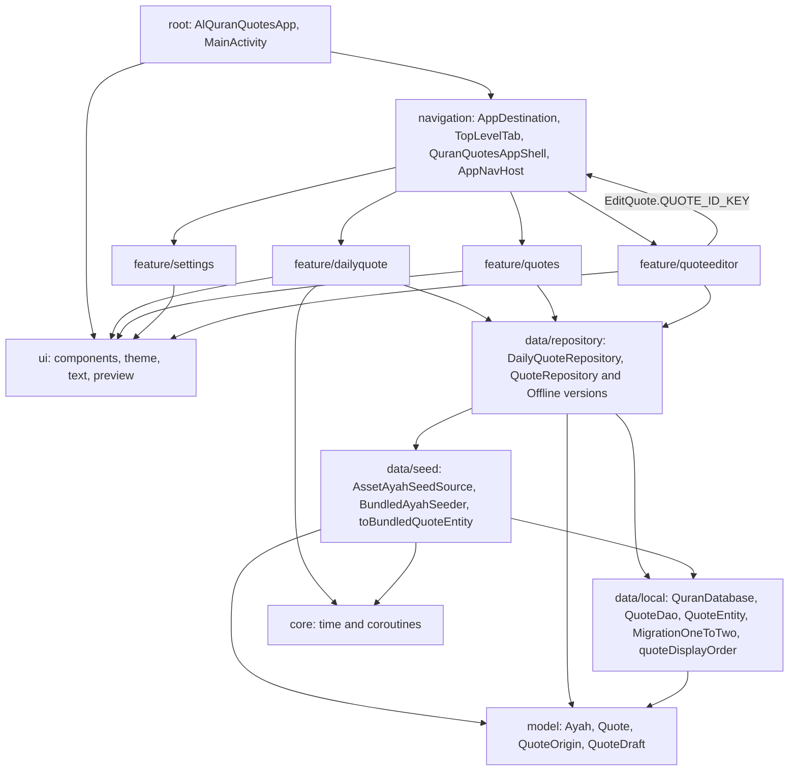
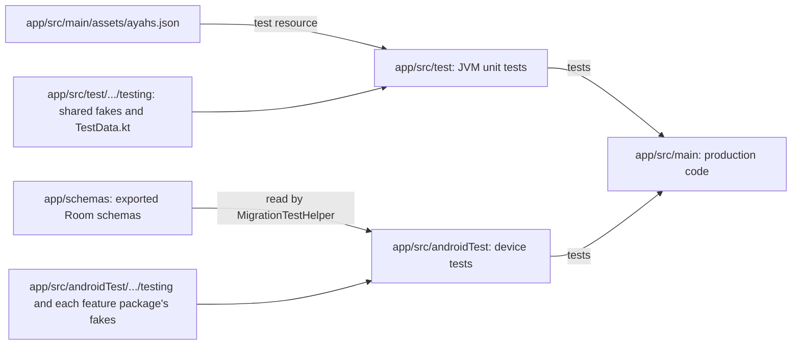

# Developer Project Structure

The project is a single Gradle module, `:app`. It stays that way until there is a real need to split it. The package name, application ID, and namespace are all `shibbir.me.alquranquotes`.

Code is organized **by feature**, not by type. A screen keeps its route, screen, ViewModel, and UI state together in one package. Shared code lives in a small set of top-level packages.

## Top-level files

- `app/build.gradle.kts`: the app build, including the Kover coverage rules.
- `gradle/libs.versions.toml`: every library and plugin version.
- `settings.gradle.kts`: repositories and the JDK toolchain resolver.
- `app/schemas/`: Room schema exports, one JSON file per database version (`1.json` with `ayahs`, and `2.json` with `quotes` and `seeded_bundled_keys`). Commit these files.
- `CLAUDE.md`: project rules. `README.md`: feature tracker.
- `docs/`: these wiki pages.
- `.github/workflows/`: CI and wiki publishing.

## Packages in `app/src/main/java/shibbir/me/alquranquotes/`

| Package | What lives there |
| --- | --- |
| (root) | `AlQuranQuotesApp` (the `@HiltAndroidApp` application) and `MainActivity` (the only activity, it shows `QuranQuotesAppShell`). |
| `navigation/` | The app shell: `AppDestination` (type-safe routes), `TopLevelTab`, `TabNavigationOptions.kt`, `QuranQuotesAppShell`, `QuranQuotesAppScaffold`, `AppNavigationBar`, `AppNavHost`, and `NavigationMotion` (the fade through). See [Navigation](Developer-Navigation.md). |
| `feature/dailyquote/` | The Home tab: `DailyQuoteScreen.kt` (route and stateless screen), `DailyQuoteViewModel`, `DailyQuoteUiState`, `DailyQuoteCard` (what the card shows for each kind of `Quote`), `DailyQuoteOriginNote` (the "Edited" or "Your quote" note), `DailyQuoteCardContent`, previews, and the preview sample `DailyQuotePreviewAyah.kt`. |
| `feature/quotes/` | The Quotes tab: `QuotesScreen.kt` (route and stateless screen), `QuotesViewModel`, `QuotesUiState`, `QuoteListCard`, `QuoteListKind` (the origin label), `QuoteListCardContent`, `AddQuoteButton`, `DeleteQuoteDialog`, and previews. |
| `feature/quoteeditor/` | The add and edit screen: `QuoteEditorScreen.kt`, `QuoteEditorViewModel`, `QuoteEditorUiState`, `QuoteEditorStatus`, `QuoteEditorForm`, `QuoteKind`, `QuoteEditorField`, `QuoteFieldInput`, `QuoteDraftValidator`, `QuoteValidationResult`, `QuoteFieldError`, `QuoteEditorTopAppBar`, and the form composables. See [Quotes and Editor](Developer-Quotes-And-Editor.md). |
| `feature/settings/` | `SettingsScreen`: a static screen with no ViewModel. |
| `data/local/` | Room: `QuranDatabase` (version 2), the DAOs `QuoteDao`, `BundledAyahSeedDao`, and `DailyQuoteDao`, the entities `QuoteEntity` (with `QuoteType` and its mappings), `SeededBundledKeyEntity`, and `AyahSeedInfoEntity`, the migration `MigrationOneToTwo`, and the pure rules `QuoteDisplayOrder.kt`, `QuoteEntityEdit.kt` (`editedWith`), `QuoteOriginAfterEdit.kt` (`afterEdit`), and `DailyAyahPosition.kt`. |
| `data/seed/` | Loading and merging the bundled ayahs: `AyahSeedSource` (interface), `AssetAyahSeedSource`, `AyahSeed`, the parser in `AyahJsonParser.kt`, `BundledQuoteEntityMapping.kt` (`toBundledQuoteEntity`), and `BundledAyahSeeder`. |
| `data/repository/` | `DailyQuoteRepository` and `OfflineDailyQuoteRepository`, `QuoteRepository` and `OfflineQuoteRepository`. |
| `model/` | UI-facing models: `Ayah`, `Quote` (`Quote.AyahQuote` and `Quote.FreeTextQuote`), `QuoteOrigin`, and `QuoteDraft`. |
| `core/time/` | Day handling: `EpochDayProvider`, `SystemEpochDayProvider`, `EpochDay.kt`, `DayChangeSource`, `SystemDayChangeSource`. |
| `core/coroutines/` | The `IoDispatcher` qualifier. |
| `di/` | Hilt modules, one per concern: `DataModule`, `DatabaseModule`, `DispatchersModule`, `TimeModule`. |
| `ui/components/` | Shared native Material 3 app bars: `TopLevelTopAppBar` (a `LargeTopAppBar` for the tabs) and `DetailTopAppBar` (a `TopAppBar` with a back arrow for detail screens). See Native Material 3 UI in [Architecture](Developer-Architecture.md). |
| `ui/theme/` | `AlQuranQuotesTheme` in `Theme.kt`, plus `Color.kt` and `AppTypography.kt`. |
| `ui/text/` | `ArabicAnnotatedText.kt`: `rememberArabicAnnotatedText` marks Arabic text so TalkBack reads it with an Arabic voice. Used by the Home card and the Quotes list. |
| `ui/preview/` | `LightDarkLargeFontPreviews`: one annotation that shows a preview in light, dark, and at twice the font size. |

A new screen gets its own package, for example `feature/favorites/`. Code that two features need goes in `ui/` (or `model/`, `data/`, `core/`), because a feature package never imports from another feature package.

This map shows the packages and which package uses which. `di` wires the classes together and is left out to keep the map readable.

## Other main resources

- `app/src/main/assets/ayahs.json`: the bundled ayahs. See [Ayah Data](Developer-Ayah-Data.md).
- `app/src/main/res/values/`: one strings file per feature, with names prefixed by the feature:
  - `strings.xml`: the app name and Home (`daily_quote_*`, `ayah_reference`).
  - `strings_navigation.xml`: the tab labels (`navigation_tab_*`).
  - `strings_quotes.xml`: the Quotes list (`quotes_*`) and the editor (`quote_editor_*`).
  - `strings_settings.xml`: Settings (`settings_*`).
- `app/src/main/res/xml/backup_rules.xml` and `data_extraction_rules.xml`: back up everything, including the database, because it holds the user's quotes.
- `app/src/main/keepRules/`: R8 keep rules. There are none yet, because the libraries ship their own.

## Source sets

| Source set | Runs on | Used for |
| --- | --- | --- |
| `app/src/main` | The app | Production code and resources. |
| `app/src/test` | The JVM on your computer | Fast unit tests for ViewModels, repositories, the seeder, validators, mappings, navigation rules, parsers, and pure functions. |
| `app/src/androidTest` | A device or emulator | Room DAO and migration tests, Compose UI tests, and anything that needs the Android framework. |

This diagram shows how the two test source sets relate to `app/src/main` and where their helpers live.

One detail is easy to miss: `src/main/assets` is also a test resources directory (see the `sourceSets` block in `app/build.gradle.kts`). That lets unit tests read the real `ayahs.json` from the classpath.

## Where fakes and helpers live

Hand-written fakes are preferred over mocks. Reuse these before writing new ones.

**Unit tests, shared helpers** in `app/src/test/java/shibbir/me/alquranquotes/testing/`:

- `FakeQuoteTables`: in-memory `quotes`, `seeded_bundled_keys`, and `ayah_seed_info`, shared by the fake DAOs. Like Room it generates growing ids and rejects a second row with the same bundled key.
- `FakeQuoteDao`, `FakeBundledAyahSeedDao` (rolls every table back when a merge fails, like a transaction), and `FakeDailyQuoteDao`. They override only the Room queries, so tests run the real `updateQuote`, `mergeBundledSeed`, and `getDailyQuote` bodies.
- `SqlRecordingDatabase`: a `SupportSQLiteDatabase` that only records `execSQL` statements, for `MigrationOneToTwoTest`.
- `ExportedSchemaIdentityHash.kt` (`readExportedSchemaIdentityHash()`): reads a version's `identityHash` from `app/schemas`, for `QuranDatabaseSchemaHistoryTest`.
- `FakeAyahSeedSource` (with `loadGate` and `nextLoadFailure`).
- `FakeDailyQuoteRepository` (with `responseGate` and `failureToThrow`) and `FakeQuoteRepository` (with `quotesGate`, `responseGate`, `failureToThrow`, and lists of every call).
- `FakeEpochDayProvider`, `FakeDayChangeSource`, `MainDispatcherRule`.
- `TestData.kt` (`testAyah`, `ashSharhSampleAyah`, `testAyahDraft`, `testFreeTextDraft`, `testBundledQuoteEntity`, `testUserAyahEntity`, `testUserFreeTextEntity`) and `BundledAyahSeedJson.kt` (`readBundledAyahSeedJson()`).

**Unit tests, helpers next to the tests that use them:**

- `data/seed/`: `SampleAyahSeeds`.
- `data/repository/`: `OfflineQuoteRepositoryTestFixture` and `StoredSampleTables.kt` (`storedSampleTables()`: an untouched bundled ayah, an edited one, and a user quote).
- `feature/dailyquote/`: `DailyQuoteViewModelTestFixture`.
- `feature/quotes/`: `SampleQuotes.kt`.
- `feature/quoteeditor/`: `QuoteEditorViewModelTestFixture` (builds the ViewModel with a `SavedStateHandle`, the way navigation does) and `FillQuoteEditorForm.kt` (`fillAyahForm()`, `fillFreeTextForm()`).
- `navigation/`: `RecordingEncoder` and `QueuedValueDecoder`, which let `AppDestinationTest` encode and decode a route without a JSON library.

**Device tests** in `app/src/androidTest/java/shibbir/me/alquranquotes/`:

- `testing/`: shared device helpers `DeviceTestData.kt` (`testBundledQuoteEntity`, `testUserAyahEntity`, `testUserFreeTextEntity`), `CreateInMemoryQuranDatabase.kt` (`createInMemoryQuranDatabase()`), and `ReceiverRecordingContext`.
- `feature/dailyquote/`: `FakeDailyQuoteRepository`, `FakeEpochDayProvider`, `FakeDayChangeSource`, and `setDailyQuoteScreen`.
- `feature/quotes/`: `DeviceQuoteCards.kt`, `RecordedQuotesScreenCallbacks`, and `setQuotesScreen`.
- `feature/quoteeditor/`: `DeviceFakeQuoteRepository`, `RecordedQuoteEditorCallbacks`, and `setQuoteEditorScreen`.

The two test source sets cannot share code, so some small duplication between them is expected.

## One class per file

Every top-level class, interface, or object has its own file with the same name. Top-level functions that belong to no class go in a file named after what they do, such as `AyahJsonParser.kt`, `EpochDay.kt`, or `TabNavigationOptions.kt`.

[Back to the Developer Guide](Developer-Guide.md)
