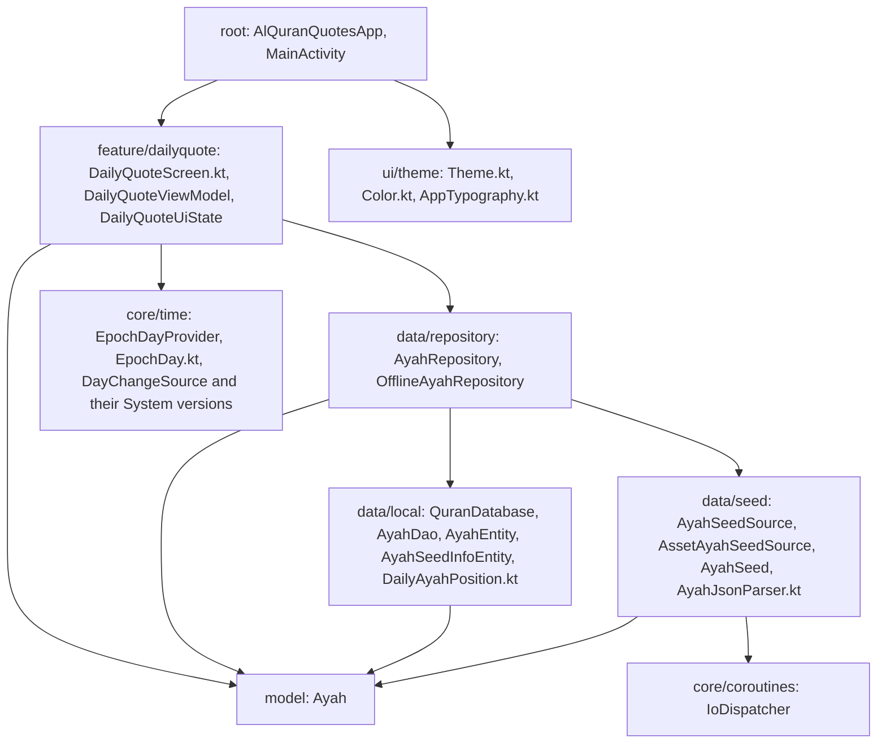
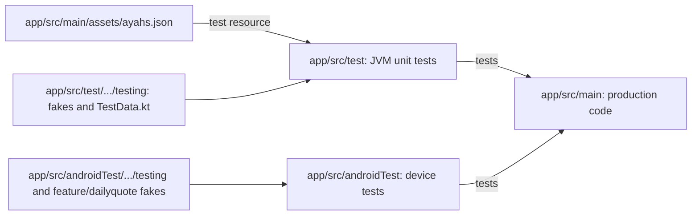

# Developer Project Structure

The project is a single Gradle module, `:app`. It stays that way until there is a real need to split it. The package name, application ID, and namespace are all `shibbir.me.alquranquotes`.

Code is organized **by feature**, not by type. A screen keeps its route, screen, ViewModel, and UI state together in one package. Shared code lives in a small set of top-level packages.

## Top-level files

- `app/build.gradle.kts`: the app build, including the Kover coverage rules.
- `gradle/libs.versions.toml`: every library and plugin version.
- `settings.gradle.kts`: repositories and the JDK toolchain resolver.
- `app/schemas/`: Room schema exports. Commit these files.
- `CLAUDE.md`: project rules. `README.md`: feature tracker.
- `docs/`: these wiki pages.
- `.github/workflows/`: CI and wiki publishing.

## Packages in `app/src/main/java/shibbir/me/alquranquotes/`

| Package | What lives there |
| --- | --- |
| (root) | `AlQuranQuotesApp` (the `@HiltAndroidApp` application) and `MainActivity` (the only activity). |
| `feature/dailyquote/` | The daily quote screen: `DailyQuoteScreen.kt` (route and stateless screen), `DailyQuoteViewModel`, `DailyQuoteUiState`, previews, and the preview sample `DailyQuotePreviewAyah.kt`. |
| `data/local/` | Room: `QuranDatabase`, `AyahDao`, the entities `AyahEntity` and `AyahSeedInfoEntity`, and the pure function in `DailyAyahPosition.kt`. |
| `data/seed/` | Loading the bundled ayahs: `AyahSeedSource` (interface), `AssetAyahSeedSource`, `AyahSeed`, and the parser in `AyahJsonParser.kt`. |
| `data/repository/` | `AyahRepository` (interface) and `OfflineAyahRepository`. |
| `model/` | UI-facing models. Today that is `Ayah`. |
| `core/time/` | Day handling: `EpochDayProvider`, `SystemEpochDayProvider`, `EpochDay.kt`, `DayChangeSource`, `SystemDayChangeSource`. |
| `core/coroutines/` | The `IoDispatcher` qualifier. |
| `di/` | Hilt modules, one per concern: `DataModule`, `DatabaseModule`, `DispatchersModule`, `TimeModule`. |
| `ui/theme/` | `AlQuranQuotesTheme` in `Theme.kt`, plus `Color.kt` and `AppTypography.kt`. |

A new screen gets its own package, for example `feature/favorites/`.

This map shows the packages, their main files, and which package uses which. `di` wires the classes together and is left out to keep the map readable.

## Other main resources

- `app/src/main/assets/ayahs.json`: the bundled ayahs. See [Ayah Data](Developer-Ayah-Data.md).
- `app/src/main/res/xml/backup_rules.xml` and `data_extraction_rules.xml`: exclude the database from backup.
- `app/src/main/keepRules/`: R8 keep rules. There are none yet, because Hilt, Room, and Compose ship their own.

## Source sets

| Source set | Runs on | Used for |
| --- | --- | --- |
| `app/src/main` | The app | Production code and resources. |
| `app/src/test` | The JVM on your computer | Fast unit tests for ViewModels, repositories, parsers, and pure functions. |
| `app/src/androidTest` | A device or emulator | Room DAO tests, Compose UI tests, and anything that needs the Android framework. |

This diagram shows how the two test source sets relate to `app/src/main` and where their helpers live.

One detail is easy to miss: `src/main/assets` is also a test resources directory (see the `sourceSets` block in `app/build.gradle.kts`). That lets unit tests read the real `ayahs.json` from the classpath.

## Where fakes and helpers live

Hand-written fakes are preferred over mocks. Reuse these before writing new ones.

**Unit tests, shared helpers** in `app/src/test/java/shibbir/me/alquranquotes/testing/`:

- `FakeAyahDao`, `FakeAyahSeedSource` (with `loadGate` and `nextLoadFailure`), `FakeAyahRepository` (with `responseGate` and `failureToThrow`).
- `FakeEpochDayProvider`, `FakeDayChangeSource`, `MainDispatcherRule`.
- `TestData.kt` (`testAyah`, `testAyahEntity`, `ashSharhSampleAyah`) and `BundledAyahSeedJson.kt` (`readBundledAyahSeedJson()`).

**Unit tests, helpers next to the tests that use them:** `SampleAyahSeeds` and `createOfflineAyahRepository` in `data/repository/`, and `DailyQuoteViewModelTestFixture` in `feature/dailyquote/`.

**Device tests** in `app/src/androidTest/java/shibbir/me/alquranquotes/`:

- `testing/`: shared device helpers `DeviceTestData.kt` and `ReceiverRecordingContext`.
- `feature/dailyquote/`: the screen's device fakes (`FakeAyahRepository`, `FakeEpochDayProvider`, `FakeDayChangeSource`).

The two test source sets cannot share code, so some small duplication between them is expected.

## One class per file

Every top-level class, interface, or object has its own file with the same name. Top-level functions that belong to no class go in a file named after what they do, such as `AyahJsonParser.kt` or `EpochDay.kt`.

[Back to the Developer Guide](Developer-Guide.md)
