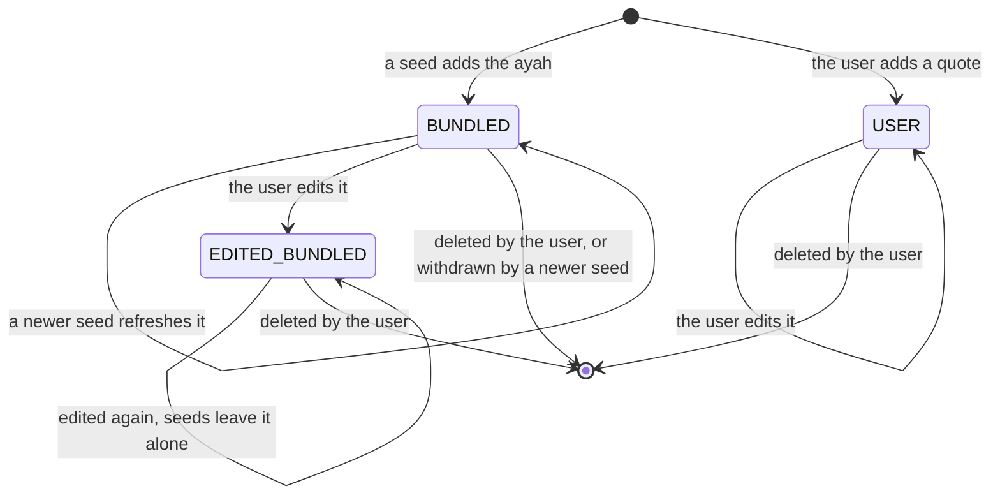
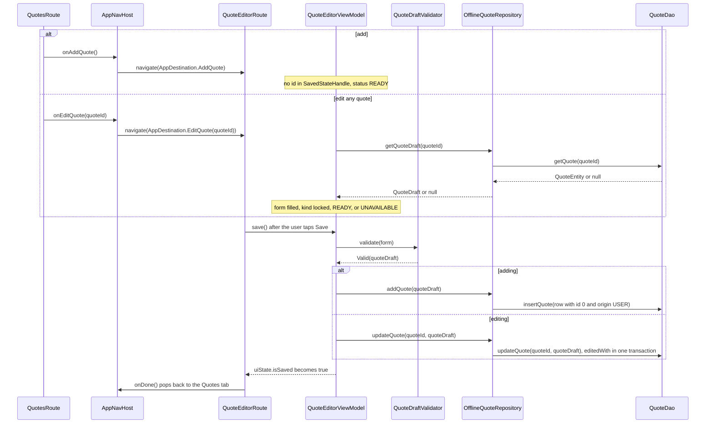
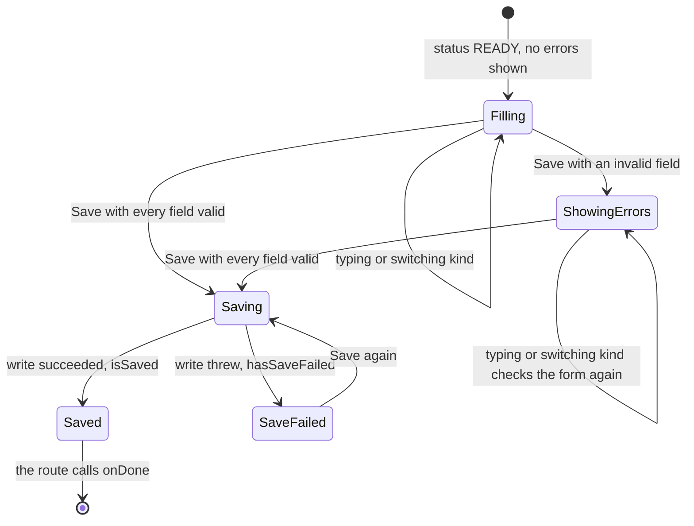

# Developer Quotes and Editor

The Quotes tab lists every quote the app can show: the bundled ayahs first, then the user's own quotes. **Every quote can be edited and deleted**, bundled or the user's own. Each card has Edit and Delete buttons and a label that says where the quote came from, and the Add button opens the quote editor. This page explains the list, the origin labels, the delete confirmation, the editor, the update rules, and the validation rules.

The code lives in `feature/quotes/` (the list) and `feature/quoteeditor/` (the editor). Both talk only to `QuoteRepository`, implemented by `OfflineQuoteRepository` (`data/repository/`).

## The list

`QuotesViewModel` builds its `StateFlow<QuotesUiState>` by combining two flows:

- `quoteRepository.observeQuotes()`: every quote in `quoteDisplayOrder`: bundled ayahs (edited or not) by surah, then ayah number, then user quotes by id, oldest first. `OfflineQuoteRepository` runs the `BundledAyahSeeder` check first, then maps `QuoteDao.observeQuotes()`, sorting each emission and mapping every row with `toQuote()`. Room emits again after every change to `quotes`, so the list updates by itself after an add, an edit, or a delete.
- `quoteIdPendingDelete`: the id of the quote whose delete confirmation is showing, or null.

The result is `QuotesUiState.Loaded(quoteCards, quoteIdPendingDelete)`. Until the first list arrives the state is `QuotesUiState.Loading`. The flow is shared with `stateIn` and `SharingStarted.WhileSubscribed(5_000)`, so a rotation does not restart it.

Each `Quote` becomes a `QuoteListCard` through `toQuoteListCard()` (`QuoteListCard.kt`), a plain mapping that `QuoteListCardTest` checks:

| `Quote` | Card | Fields |
| --- | --- | --- |
| `Quote.AyahQuote` | `AyahCard` | `quoteId`, `kind`, the Arabic text, the translation, and the surah name and numbers. |
| `Quote.FreeTextQuote` | `FreeTextCard` | `quoteId`, `kind`, the text, and the reference (a blank one becomes null and is left out). |

`quoteId` is also the key of the `LazyColumn`, and it is unique across the whole list because every quote is a row of the one `quotes` table. The list has extra bottom padding (96 dp) so the Add button never covers the last card's buttons.

## Origin labels

`kind` is a `QuoteListKind`, worked out by `Quote.toQuoteListKind()` (`QuoteListKind.kt`) from the quote's kind and its `origin`. Each value carries the label the card shows. `QuoteListKindTest` checks every pair and every label.

| Kind | `QuoteOrigin` | `QuoteListKind` | Label |
| --- | --- | --- | --- |
| Ayah | `BUNDLED` | `BUNDLED_AYAH` | "Bundled ayah" |
| Ayah | `EDITED_BUNDLED` | `EDITED_BUNDLED_AYAH` | "Bundled ayah, edited" |
| Ayah | `USER` | `USER_AYAH` | "My ayah" |
| Free text | `BUNDLED` | `BUNDLED_FREE_TEXT` | "Bundled quote" |
| Free text | `EDITED_BUNDLED` | `EDITED_BUNDLED_FREE_TEXT` | "Bundled quote, edited" |
| Free text | `USER` | `USER_FREE_TEXT` | "My quote" |

Bundled rows are always ayahs today, and a quote can never change its kind, so the two bundled free text kinds cannot happen yet. They exist so the mapping covers every pair.

## The Add button

`AddQuoteButton` is a Material 3 `ExtendedFloatingActionButton`. It shows the icon and "Add quote" while the list is at its top (`firstVisibleItemIndex == 0`), and shrinks to the icon alone once the list has scrolled. It keeps "Add quote" as its content description, so TalkBack still reads the label when only the icon shows.

## Delete confirmation

Deleting takes two steps, so a quote is never lost to a stray tap:

1. The Delete button calls `QuotesViewModel.requestDelete(quoteId)`. That only sets `quoteIdPendingDelete`.
2. While it is set, `QuotesScreen` shows `DeleteQuoteDialog` ("Delete this quote?").
3. **Delete** calls `confirmDelete()`: it clears the pending id first, then calls `quoteRepository.deleteQuote(quoteId)` in `viewModelScope`. **Cancel** (or tapping outside) calls `dismissDelete()`, which only clears the pending id.

`confirmDelete()` with no pending id does nothing. The pending id is part of the UI state, so the dialog comes back after a rotation.

Any quote can be deleted. `QuoteDao.deleteQuote` removes only the row. For a bundled ayah its key stays in `seeded_bundled_keys`, so an app update never adds it back (see [Ayah Data](Developer-Ayah-Data.md)).

## The editor: one screen, two destinations

`AppDestination.AddQuote` and `AppDestination.EditQuote(quoteId)` both show `QuoteEditorRoute`, with the same `QuoteEditorViewModel`. The only difference is the route argument:

- Navigation Compose puts the properties of a type-safe route into the destination's `SavedStateHandle`, under the property name.
- `QuoteEditorViewModel` reads it with `savedStateHandle.get<Long>(AppDestination.EditQuote.QUOTE_ID_KEY)`. The constant is `"quoteId"` and must match the property name. `AppDestinationTest.quoteIdKeyMatchesThePropertyName` guards that.
- No id means adding a new `USER` quote. An id means editing that quote, whatever its origin.

Tests build the ViewModel the same way: `QuoteEditorViewModelTestFixture.createViewModel(quoteId)` puts the id into a `SavedStateHandle` under the same key.

## Editor state

`QuoteEditorUiState` is one data class:

- `isEditing`: false when adding. It picks the title ("Add quote" or "Edit quote"). When editing, the kind is **locked**: `QuoteEditorFormContent` hides the kind picker, and `selectQuoteKind()` ignores any call.
- `status` (`QuoteEditorStatus`): `LOADING` while the edited quote loads, `READY` when the form shows, `UNAVAILABLE` when the quote could not be loaded (it was deleted, or reading it threw). Adding starts at `READY`.
- `form` (`QuoteEditorForm`): every field exactly as typed, as strings, plus the selected `QuoteKind`.
- `fieldErrors`, `hasAttemptedSave`, `isSaving`, `hasSaveFailed`, and `isSaved`.
- `canSave`: true only when `status` is `READY` and no save is running. The Save action in `QuoteEditorTopAppBar` (built on `DetailTopAppBar`) is enabled only then, and `save()` ignores a call otherwise.

`QuoteKind` has two values, `AYAH` and `FREE_TEXT`. Each one lists the `QuoteEditorField`s it shows, in order. Each field knows its label and its `QuoteFieldInput` (keyboard type, single or multi line, and right to left for the Arabic text). While adding, switching kinds keeps what was typed in every field; only the fields of the selected kind are validated and saved.

The form scrolls and uses `imePadding()`, so every field stays reachable above the keyboard, even with large fonts. The top app bar stays pinned and tints while the form scrolls under it.

## Update rules

`QuoteRepository` has one set of functions for every quote: `observeQuotes()`, `getQuoteDraft(quoteId)`, `addQuote(quoteDraft)`, `updateQuote(quoteId, quoteDraft)`, and `deleteQuote(quoteId)`.

- `addQuote` saves a new row of origin `USER` with a generated id and returns it.
- `updateQuote` calls `QuoteDao.updateQuote(quoteId, quoteDraft)`, which reads the stored row and writes it back in **one transaction**, through `editedWith(quoteDraft)`:
  - The row keeps its `id` and its `bundled_key`.
  - The origin moves on with `QuoteOrigin.afterEdit()`: `BUNDLED` becomes `EDITED_BUNDLED`, so a later seed never overwrites it. `EDITED_BUNDLED` and `USER` stay as they are.
  - **The kind cannot change.** A draft of the other kind throws an `IllegalArgumentException`, and nothing is written. The editor never sends one, because it locks the kind.
  - A quote that no longer exists is left alone: nothing is written.

This state diagram shows how a quote's origin changes over its life.

## Add and edit, step by step

This sequence shows adding and editing a quote, from the Quotes tab to Room and back.

## Validation rules

`QuoteDraftValidator` (`feature/quoteeditor/QuoteDraftValidator.kt`) checks a `QuoteEditorForm`. `validate(form)` returns `QuoteValidationResult.Valid(quoteDraft)` with the trimmed, parsed values, or `QuoteValidationResult.Invalid(fieldErrors)`. `fieldErrorsOf(form)` returns just the error map. Only the fields of the form's kind are checked.

"Blank" means empty or only spaces. Numbers are trimmed, then parsed as whole numbers.

| Kind | Field | Rule | Error (`QuoteFieldError`) |
| --- | --- | --- | --- |
| Ayah | Surah name | not blank | `REQUIRED` |
| Ayah | Surah number | not blank, a whole number, 1 to 114 | `REQUIRED`, `NOT_A_NUMBER`, `SURAH_NUMBER_OUT_OF_RANGE` |
| Ayah | Ayah number | not blank, a whole number, 1 or more | `REQUIRED`, `NOT_A_NUMBER`, `AYAH_NUMBER_TOO_SMALL` |
| Ayah | Arabic text | not blank | `REQUIRED` |
| Ayah | Translation | not blank, any language | `REQUIRED` |
| Free text | Text | not blank, any language | `REQUIRED` |
| Free text | Reference | optional; a blank one is saved as an empty string | none |

Each `QuoteFieldError` carries the message shown under the field, for example "Enter a number from 1 to 114".

When errors show matters as much as the rules. Errors stay hidden while the user first fills the form. The first Save with an invalid field shows every error and sets `hasAttemptedSave`. From then on, every keystroke and every kind switch checks the form again, so an error disappears as soon as the field is fixed.

This state diagram shows the editor from a ready form to leaving the screen.

## Saving and the saved signal

- `save()` validates. When valid, it sets `isSaving` (and clears `hasSaveFailed`), then calls `addQuote` or `updateQuote` in `viewModelScope`. An update keeps the quote's id, so its place in the list and in the daily rotation stays the same, unless the user changed the numbers of a bundled ayah, which then sorts by its new numbers.
- If the write throws, `hasSaveFailed` becomes true and the form shows "Could not save the quote. Please try again." The form keeps everything, so the user can tap Save again. A cancelled ViewModel rethrows through `ensureActive()` instead of writing state.
- If the write succeeds, `isSaved` becomes true. The ViewModel never navigates. `QuoteEditorRoute` watches the flag with `LaunchedEffect(isSaved)` and calls `onDone`, which `AppNavHost` wires to `navController.popBackStack()`. The list is already up to date, because it observes Room.
- The back arrow in the top app bar calls `onDone` directly, without saving.

## Tests to read

- Unit tests, list: `QuotesViewModelTest`, `QuotesViewModelDeleteTest` (including `confirmingDeletesABundledAyah`), `QuoteListCardTest`, and `QuoteListKindTest`.
- Unit tests, editor: `QuoteEditorViewModelAddTest`, `QuoteEditorViewModelEditTest` (including `theKindCannotBeChangedWhileEditing`), `QuoteEditorViewModelBundledTest`, `QuoteEditorViewModelFieldErrorTest`, `QuoteEditorViewModelSavingTest`, `QuoteDraftValidatorAyahTest`, `QuoteDraftValidatorFreeTextTest`, `QuoteEditorFormTest`, and `QuoteKindTest`.
- Unit tests, data: `QuoteEntityToQuoteTest`, `QuoteEntityToQuoteDraftTest`, `QuoteDraftToQuoteEntityTest`, `QuoteOriginAfterEditTest`, `OfflineQuoteRepositoryObserveTest`, `OfflineQuoteRepositoryDraftTest`, `OfflineQuoteRepositoryCrudTest`, and `OfflineQuoteRepositoryUpdateTest`.
- Device tests: `QuotesScreenTest`, `QuotesScreenDeleteTest`, `QuoteEditorScreenTest`, `QuoteEditorScreenStateTest`, `QuoteEditorRouteTest`, `QuoteDaoTest`, `QuoteDaoFlowTest`, and `OfflineQuoteRepositoryDeviceTest`.

[Back to the Developer Guide](Developer-Guide.md)
