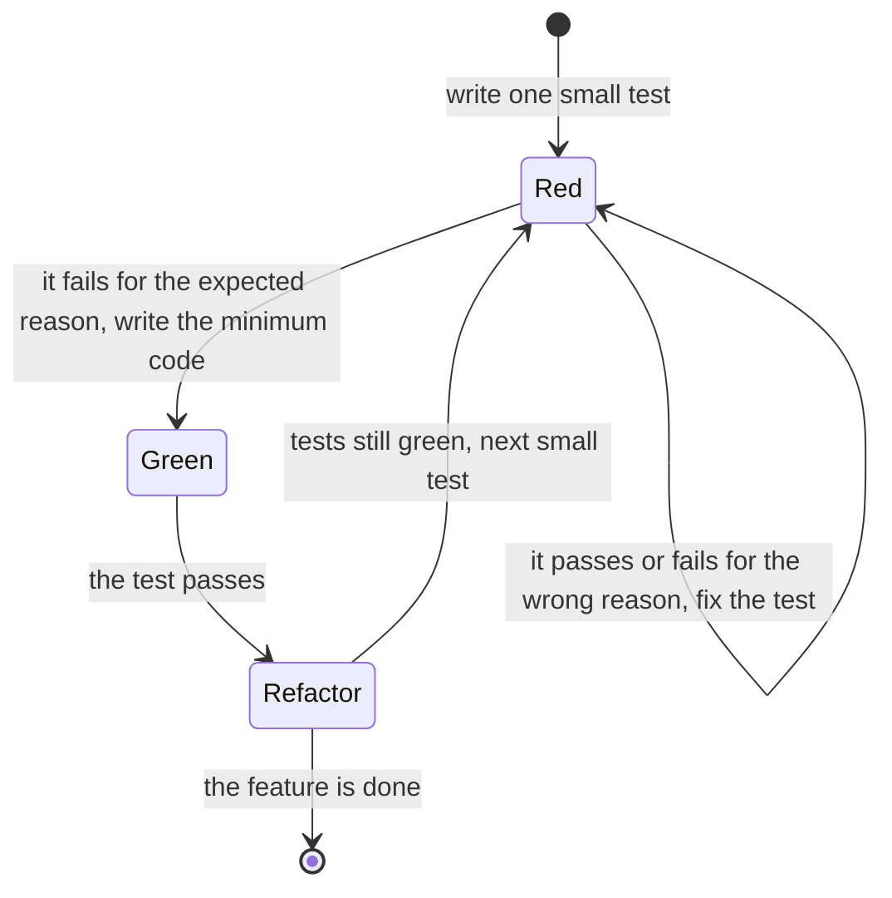
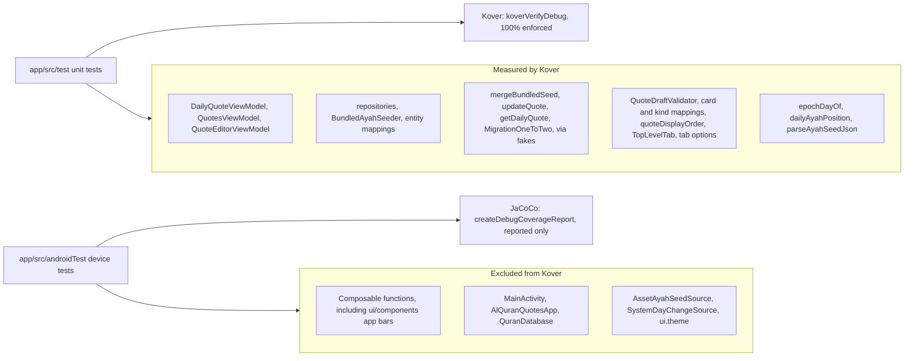

# Developer Testing and Coverage

Tests are not optional here. Every feature is built test first, and the JVM unit tests must cover 100% of the lines and branches they can reach. This page explains how the tests are organized, how to run them, and how to read the coverage reports.

## The TDD rule

Every feature and fix is built in real red, green, refactor cycles:

1. **Red:** write one small test, run it, and see it fail for the expected reason.
2. **Green:** write the minimum code that makes it pass, and run it again.
3. **Refactor:** clean up while the tests stay green.

Then repeat with the next small test. Writing all the tests first without running them is not TDD, and feature code is never written without a test that was seen failing first.

This state diagram shows one cycle.



### Parallel agents work in their own copies

When several agents (people or AI assistants) build parts of a feature at the same time, each one works in its **own copy of the project**, not in the shared working tree. That way each agent can run Gradle and its tests at every step of its own cycles, and really see each test fail and then pass, without breaking the others. The editable bundled ayahs, the single `quotes` table, and the native app bars were built this way.

- Each agent owns a fixed set of files. Only those files are copied back into the real tree.
- Temporary stubs, made only to keep a copy compiling, are never copied back.
- The coordinator then builds and runs the full suite in the real tree.

## Test types per layer

| Layer | Test type | Where | Examples |
| --- | --- | --- | --- |
| ViewModels | JVM unit tests with `kotlinx-coroutines-test` (`runTest`, a test dispatcher set as Main) and fake repositories | `app/src/test` | `DailyQuoteViewModelTest`, `QuotesViewModelDeleteTest`, `QuoteEditorViewModelAddTest` |
| Repositories and the seeder | JVM unit tests with fake DAOs and data sources | `app/src/test` | `OfflineDailyQuoteRepositoryTest`, `OfflineQuoteRepositoryUpdateTest`, `BundledAyahSeederMergeTest` |
| Validators, mappings, and ordering rules | JVM unit tests | `app/src/test` | `QuoteDraftValidatorAyahTest`, `QuoteListKindTest`, `QuoteEntityToQuoteTest`, `QuoteDisplayOrderTest`, `TabNavigationOptionsTest` |
| Pure functions and parsers | JVM unit tests | `app/src/test` | `EpochDayTest`, `DailyAyahPositionTest`, `AyahJsonParserTest` |
| Room migrations, statements | JVM unit test with `SqlRecordingDatabase` | `app/src/test` | `MigrationOneToTwoTest` |
| Room schema history | JVM unit test that pins each exported schema's `identityHash` in `app/schemas` | `app/src/test` | `QuranDatabaseSchemaHistoryTest` |
| Room DAOs | Instrumented tests against an in-memory database (`createInMemoryQuranDatabase()`) | `app/src/androidTest` | `QuoteDaoTest`, `QuoteDaoFlowTest`, `BundledAyahSeedDaoTest`, `DailyQuoteDaoTest` |
| Room migrations, real database | Instrumented test with `MigrationTestHelper` against `app/schemas` | `app/src/androidTest` | `QuranDatabaseMigrationTest` |
| Compose screens and shared components | UI tests with `createComposeRule()` against the stateless composable | `app/src/androidTest` | `DailyQuoteScreenTest`, `QuotesScreenTest`, `QuoteEditorScreenTest`, `SettingsScreenTest`, `QuranQuotesAppScaffoldTest`, `TopLevelTopAppBarTest`, `DetailTopAppBarTest` |
| Route composables | UI tests that pass a ViewModel built with fakes | `app/src/androidTest` | `DailyQuoteRouteTest`, `QuoteEditorRouteTest` |
| Android-bound classes | Instrumented tests | `app/src/androidTest` | `SystemDayChangeSourceTest`, `AlQuranQuotesThemeTest` |
| Whole app | One smoke test with the real Hilt graph, Room file, and asset | `app/src/androidTest` | `MainActivityTest` |

`MainActivityTest` must hold **exactly one test** (`launchesOnTheAyahOfTheDayAndMovesBetweenTabs`). It runs the real Hilt graph, whose singleton database stays open for the whole test process. A second test would delete the database file under that open singleton.

## The numbers today

- **177 JVM unit tests** in `app/src/test`, at **100% line and 100% branch coverage** (Kover): 654 of 654 lines and 134 of 134 branches.
- **91 device tests** in `app/src/androidTest`. They compile locally (`./gradlew assembleDebugAndroidTest`) and run on the API 35 emulator in CI.

The test classes that came with the single `quotes` table, editable bundled ayahs, and the native app bars:

- Data, JVM: `QuoteEntityToQuoteTest`, `QuoteEntityToQuoteDraftTest`, `QuoteDraftToQuoteEntityTest`, `QuoteOriginAfterEditTest`, `QuoteDisplayOrderTest`, `MigrationOneToTwoTest`, `QuranDatabaseSchemaHistoryTest`, `BundledQuoteEntityMappingTest`, `BundledAyahSeederMergeTest`, `OfflineQuoteRepositoryDraftTest`, and `OfflineQuoteRepositoryUpdateTest`.
- Data, device: `QuoteDaoTest`, `QuoteDaoFlowTest`, `BundledAyahSeedDaoTest`, and `QuranDatabaseMigrationTest`, rewritten for the hand-written migration.
- UI, JVM: `QuoteListKindTest`, `DailyQuoteOriginNoteTest`, and `QuoteEditorViewModelBundledTest`.
- UI, device: `TopLevelTopAppBarTest` and `DetailTopAppBarTest`.

Older classes that still cover the rest: `BundledAyahSeederLoadingTest`, `BundledAyahSeederVersionTest`, `OfflineQuoteRepositoryObserveTest`, `OfflineQuoteRepositoryCrudTest`, `OfflineDailyQuoteRepositoryTest`, the `QuotesViewModel*`, `QuoteEditorViewModel*`, and `QuoteDraftValidator*` tests, `AppDestinationTest`, `NavigationMotionTest`, and on a device `DailyQuoteDaoTest`, `OfflineQuoteRepositoryDeviceTest`, `OfflineDailyQuoteRepositoryDeviceTest`, and the screen and route tests.

## Fakes, not mocks

The project uses hand-written fakes, not a mocking library. Fakes are small classes that implement the same interface as the real thing and let a test control it. Some useful controls:

- `FakeDailyQuoteRepository.responseGate`: holds a call suspended, so a test can see the `Loading` state.
- `FakeQuoteRepository`: `quotesGate` holds back the first list, `responseGate` holds every suspending call, `failureToThrow` makes calls fail, and it records every add, update, delete, and read. An update moves a `BUNDLED` quote to `EDITED_BUNDLED`, like the real repository.
- `FakeQuoteTables` holds the in-memory `quotes`, `seeded_bundled_keys`, and `ayah_seed_info` tables. `FakeQuoteDao`, `FakeBundledAyahSeedDao`, and `FakeDailyQuoteDao` share one instance and override only the Room queries, so unit tests run the real `QuoteDao.updateQuote`, `BundledAyahSeedDao.mergeBundledSeed`, and `DailyQuoteDao.getDailyQuote` bodies. `FakeBundledAyahSeedDao` also rolls every table back when a merge fails, like a transaction.
- `SqlRecordingDatabase`: records the statements a `Migration` runs, so `MigrationOneToTwoTest` can check them on the JVM.
- `FakeAyahSeedSource.loadGate` and `nextLoadFailure`: start several callers during one load, or make one load fail.
- `MainDispatcherRule`: sets a test dispatcher as Main. It uses `UnconfinedTestDispatcher` by default, and you can pass a `StandardTestDispatcher` when the order of resumption matters.
- `QuoteEditorViewModelTestFixture`: builds `QuoteEditorViewModel` with a `SavedStateHandle` holding the edited quote's id, the way navigation does.

See [Project Structure](Developer-Project-Structure.md) for the full list and where each fake lives. Reuse them before writing new ones. Plain unit tests build classes directly with fakes and do not use Hilt. Device tests of a route build the ViewModel with device fakes and pass it in, so they do not need Hilt either.

## Running tests

```bash
./gradlew testDebugUnitTest            # all JVM unit tests
./gradlew assembleDebugAndroidTest     # compile the device tests without a device
./gradlew connectedDebugAndroidTest    # all instrumented tests (device or emulator)

# one unit test class, or one method
./gradlew testDebugUnitTest --tests "shibbir.me.alquranquotes.feature.quoteeditor.QuoteEditorViewModelEditTest"
./gradlew testDebugUnitTest --tests "shibbir.me.alquranquotes.feature.dailyquote.DailyQuoteViewModelTest.showsErrorWhenLoadingFails"

# one instrumented test class
./gradlew connectedDebugAndroidTest -Pandroid.testInstrumentationRunnerArguments.class=shibbir.me.alquranquotes.data.local.QuranDatabaseMigrationTest
```

You can also run any test from Android Studio with the green arrow next to it.

**Device tests: compile locally, run in CI.** Without a device or emulator, at least compile the device tests with `./gradlew assembleDebugAndroidTest` so a broken test does not reach the pull request. CI runs every device test on an API 35 emulator (`createDebugCoverageReport -PdeviceTestCoverage`, see [CI and Release](Developer-CI-And-Release.md)). If you do have a device or emulator, run them locally too.

## Unit test coverage with Kover

Kover measures JVM unit-test coverage. The rule lives in the `kover` block of `app/build.gradle.kts`.

```bash
./gradlew koverVerifyDebug       # runs the unit tests, fails below 100% line or branch coverage
./gradlew koverHtmlReportDebug   # writes the HTML report
```

Open `app/build/reports/kover/htmlDebug/index.html` in a browser. Click into a package and a class to see each line. Red lines never ran. Yellow lines are branches where only some paths ran. Your goal is no red and no yellow.

## What Kover excludes, and why

Some code cannot run on the plain JVM, or is not ours to test. The full, authoritative list is in `CLAUDE.md`. In short:

- **Generated code:** Hilt and Dagger factories and injectors, Room `_Impl` classes, Compose singletons, and the kotlinx.serialization `$$serializer` classes of the navigation routes.
- **Android-bound code covered by device tests instead:** `@Composable` functions, `@dagger.Module` classes, `MainActivity`, `AlQuranQuotesApp`, `QuranDatabase`, `AssetAyahSeedSource`, `SystemDayChangeSource`, and the `ui.theme` package.

`@Preview` composables are development tools that never ship, so they need no tests.

Logic that could hide inside composables is kept out of them on purpose, so Kover still measures it: `DailyQuoteCard`, `DailyQuoteOriginNote`, `QuoteListCard`, `QuoteListKind`, `QuoteDraftValidator`, `QuoteEditorForm`, `TopLevelTab.selectedBy`, `applyTabNavigationOptions`, and `NavigationMotion` are all plain Kotlin with unit tests.

This diagram shows which tests exercise which code, and which report measures it. Kover only counts the unit tests, over the code it does not exclude. The device tests cover the excluded code, and JaCoCo reports on it.



The device tests also run some JVM code, for example `QuoteDaoTest`, `BundledAyahSeedDaoTest`, and `DailyQuoteDaoTest` run the real Room DAOs, and that shows up in the JaCoCo report too.

**Never add an exclusion just to reach 100%.** Make the code testable instead (inject the dependency, remove an impossible branch) or write the missing test. A new Android-bound class may be excluded only if an instrumented test covers it, and the exclusion must be listed in `CLAUDE.md` in the same pull request.

## Device test coverage with JaCoCo

The debug build type sets `enableAndroidTestCoverage = true`, which turns on AGP's built-in JaCoCo support.

```bash
./gradlew createDebugCoverageReport -PdeviceTestCoverage
```

This runs the instrumented tests on a connected device or emulator, then writes a report to `app/build/reports/coverage/androidTest/debug/connected/index.html`.

This report measures the code Kover excludes: composables, `MainActivity`, the Room database, `SystemDayChangeSource`, and `AssetAyahSeedSource`. It is **reported, not enforced**, for now. Use it to check that a new Android-bound class really is exercised by a device test. The report reads the same way as the Kover one: open a package, then a class, and look for lines that never ran.

## Before you call a feature done

- Every piece of code was written in a red, green, refactor cycle.
- `./gradlew koverVerifyDebug` passes (unit tests green and 100% coverage).
- `./gradlew lintDebug` passes.
- The device tests compile (`./gradlew assembleDebugAndroidTest`) and pass in CI, or on your device or emulator.

[Back to the Developer Guide](Developer-Guide.md)
