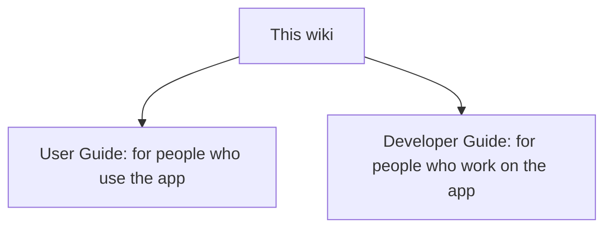

# Al Quran Quotes

Al Quran Quotes is a small Android app that shows one ayah (verse) of the Quran each day, with the Arabic text, an English translation, and the surah and ayah reference. It works offline.

This wiki has two guides:

- [User Guide](User-Guide.md): for people who use the app. How to use it, reading comfort, privacy, and common questions.
- [Developer Guide](Developer-Guide.md): for people who work on the app. Setup, architecture, data, testing and coverage, CI, and how to contribute.

This picture shows the two guides and who each one is for.

These pages are written in the `docs/` folder of the repository and published here automatically. To change a page, edit it in `docs/` through a pull request.
