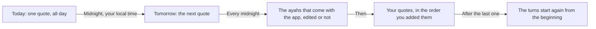

# The Daily Quote

When you open the app, you see the **Home** tab: the quote of the day. Most days this is one of the ayahs that come with the app. If you added your own quotes, some days it is one of yours. If you edited one of the ayahs that come with the app, Home shows it the way you edited it.

## What the Home tab shows

The app's name, **Al Quran Quotes**, is at the top in large letters. When you scroll down, it shrinks into a smaller bar. Under it, the quote sits in a card.

For an ayah, from top to bottom:

- **Ayah of the day**: the heading of the card.
- **Your quote**: a small label, shown only if you added this ayah yourself.
- **Edited**: a small label, shown only if this is one of the ayahs that come with the app and you edited it.
- **The Arabic text** of the ayah, written right to left.
- **The translation**. For the ayahs that come with the app, this is the English translation by Saheeh International, unless you edited it. For an ayah you added, it is the translation you typed.
- **The reference**: the surah name, then the surah number and ayah number. For example, "Ash-Sharh 94:5" means surah Ash-Sharh (surah 94), ayah 5.

For free text you added:

- **Quote of the day**: the heading of the card.
- **Your quote**: a small label.
- **Your text**.
- **The reference**, if you gave one.

If the quote is long, or your text is large, you can scroll down to read all of it.

## How the quote changes

- You see **one quote for the whole day**. Opening the app again on the same day shows the same quote.
- A new quote comes at **midnight, in your local time**.
- This also works if the app stays open past midnight. The screen changes to the new quote by itself.
- If you travel and your phone moves to a new time zone, the app uses your new local day.
- The quotes take turns in the same order as the Quotes tab: first the ayahs that come with the app (including the ones you edited), in order of surah and ayah number, then your own quotes in the order you added them. After the last one, the turns start again from the beginning.
- When you add or delete any quote, the list of turns gets longer or shorter. Changing the surah or ayah number of a bundled ayah can also move it in the order. So the quote you see on later days can change.

This picture shows how the quote changes from day to day.

To add your own quotes, or to edit or delete any quote, see [Your quotes](User-Quotes.md).

## While it loads

For a short moment you may see a small spinning circle. This means the app is getting today's quote ready. It is usually very fast.

This picture shows what you see when you open the app.

```mermaid
flowchart TD
    OpenApp["You open the app"] --> Loading["A small spinning circle, for a moment"]
    Loading -->|"Ready"| QuoteShown["You see the quote of the day"]
    Loading -->|"Rare problem"| ErrorMessage["A message: Could not load today's quote, with a Retry button"]
    ErrorMessage -->|"You tap Retry"| Loading
```

## If it says "Could not load today's quote."

This is rare. If it happens:

1. Tap the **Retry** button.
2. If it still does not work, close the app fully and open it again.
3. If the problem continues, restart your phone and try again.

You do not need internet to fix this. The quotes are stored inside the app.

If you deleted every quote in the **Quotes** tab, there is nothing to show, so you see this message. Add a quote with **Add quote** in the Quotes tab, then come back to Home and tap **Retry**. See [Your quotes](User-Quotes.md).

[Back to the User Guide](User-Guide.md)
