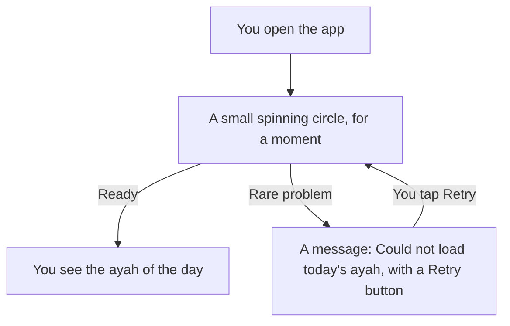

# The Daily Ayah

When you open the app, you see one screen: the ayah of the day.

## What the screen shows

From top to bottom:

- **Ayah of the day**: the title of the screen.
- **The Arabic text** of the ayah, written right to left.
- **The English translation** (Saheeh International).
- **The reference**: the surah name, then the surah number and ayah number. For example, "Ash-Sharh 94:5" means surah Ash-Sharh (surah 94), ayah 5.

If the ayah is long, or your text is large, you can scroll down to read all of it.

## How the ayah changes

- The app has a set of 33 ayahs inside it.
- You see **one ayah for the whole day**. Opening the app again on the same day shows the same ayah.
- A new ayah comes at **midnight, in your local time**.
- This also works if the app stays open past midnight. The screen changes to the new ayah by itself.
- If you travel and your phone moves to a new time zone, the app uses your new local day.
- After all 33 ayahs have been shown, the set starts again from the beginning.

This picture shows how the ayah changes from day to day.

## While it loads

For a short moment you may see a small spinning circle. This means the app is getting today's ayah ready. It is usually very fast.

This picture shows what you see when you open the app.

## If it says "Could not load today's ayah."

This is rare. If it happens:

1. Tap the **Retry** button.
2. If it still does not work, close the app fully and open it again.
3. If the problem continues, restart your phone and try again.

You do not need internet to fix this. The ayahs are stored inside the app.

[Back to the User Guide](User-Guide.md)
