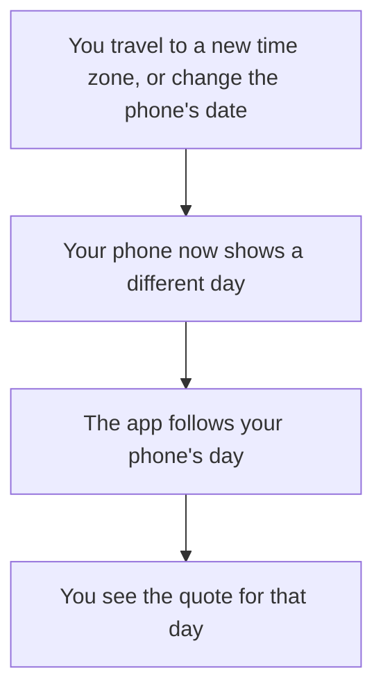

# Questions and Answers

## Why do I see the same quote all day?

The app shows one quote per day. This gives you time to read it, think about it, and come back to it during the day.

## When does the quote change?

At midnight, in your local time. If the app is open at midnight, the screen changes to the new quote by itself.

## What if I travel to another time zone?

The app follows the time zone of your phone. When your phone changes to the new time zone, the app uses your new local day. So you may get the next quote a little earlier or later than at home.

This picture shows what happens when you travel, or when you change the date on your phone.

## Can I go back to yesterday's quote or skip ahead?

Not on the Home tab, which shows only today's quote. But you can read every quote at any time in the **Quotes** tab. See [Your quotes](User-Quotes.md).

## How many quotes are there?

33 ayahs come with the app. You have those, plus the quotes you added, minus any quotes you deleted. After all of them have been shown, they start again from the beginning.

## Does it need internet?

No. The app works fully offline. It does not use the internet at all.

## Why do the colors look different on my phone?

On Android 12 and newer, the app's colors follow your wallpaper. A different wallpaper gives different colors. The app also follows your phone's dark or light mode. See [Reading comfort](User-Reading-Comfort.md).

## Can I make the text bigger?

Yes. Change the font size in your phone's settings. The app follows it. See [Reading comfort](User-Reading-Comfort.md).

## Can I add my own translation?

Yes. Open the **Quotes** tab, tap **Add quote**, and choose **Free text**. Type the translation in your own language, and add the reference if you like. You can also choose **Ayah** and add the Arabic text with a translation in any language. See [Your quotes](User-Quotes.md).

## Why did my quote appear on Home?

Your quotes take turns with the ayahs that come with the app. First come the bundled ayahs, then your quotes in the order you added them. On a day when it is your quote's turn, Home shows it with the label **Your quote**. See [The daily quote](User-Daily-Ayah.md).

## Can I edit the bundled ayahs?

Yes. In the **Quotes** tab, every card has a pencil button to edit it and a bin button to delete it, including the ayahs that come with the app. An edited one is labelled **Bundled ayah, edited** in the Quotes tab, and **Edited** on Home. Your change is only in your copy of the app, so please change the Quran text and translation with care. See [Your quotes](User-Quotes.md).

## What happens to my changes when the app updates?

They are kept. An update can add new ayahs, and it refreshes the bundled ayahs you never changed. It does not overwrite an ayah you edited, it does not bring back an ayah you deleted, and it does not touch the quotes you added. See [Your quotes](User-Quotes.md).

## Can I get a deleted bundled ayah back?

Not on its own. A deleted bundled ayah does not come back, not even after an app update. You can add it again yourself: in the **Quotes** tab, tap **Add quote**, choose **Ayah**, and copy the text carefully from a trusted source. It then shows as **My ayah**, with your other quotes. See [Your quotes](User-Quotes.md).

## Will my quotes be kept if I change phones?

They can be. Your quotes are included in your phone's Android backup. If backup is turned on, and you restore it on your new phone, your quotes can come back. If backup is off, they stay only on the old phone. See [Privacy and offline use](User-Privacy-And-Offline.md).

## It says "Could not load today's quote." What do I do?

Tap **Retry**. If that does not help, close and open the app again. See [The daily quote](User-Daily-Ayah.md).

## Does the app collect my data?

No. It asks for no permissions and collects nothing. See [Privacy and offline use](User-Privacy-And-Offline.md).

## Can I mark favorites or share an ayah?

Not yet. These are planned. See [Coming soon](User-Coming-Soon.md).

## How do I report a mistake or a problem?

Please open an issue on the project's GitHub page: https://github.com/shibbirweb/al-quran-quotes-android/issues

Tell us what you saw, which ayah it was (the reference, like "Ash-Sharh 94:5"), and your Android version if the problem is with the app itself. If you think a text or translation does not match the source, say so, and it will be checked against the source.

[Back to the User Guide](User-Guide.md)
