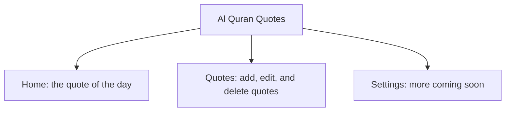

# User Guide

Assalamu alaikum, and welcome to Al Quran Quotes.

Al Quran Quotes is a small Android app. Each day it shows you one quote. Most days this is an ayah (verse) from the Quran, with the Arabic text, an English translation, and the name and number of the surah and ayah. You can also add your own quotes, and they take turns too.

The app is simple and quiet. It works without internet, it asks for no permissions, and it collects no data about you.

## The three tabs

At the bottom of the screen there is a bar with three tabs:

- **Home**: the quote of the day. See [The daily quote](User-Daily-Ayah.md).
- **Quotes**: every quote in the app. Here you add your own quotes, and edit or delete any quote, including the ayahs that come with the app. See [Your quotes](User-Quotes.md).
- **Settings**: a first look at settings. More are coming. See [Settings](User-Settings.md).

Each tab has its name at the top in large letters. When you scroll down, the name shrinks into a smaller bar, so you have more room to read.

This picture shows the three tabs and what each one is for.

## What you can read here

- [Installing the app](User-Installing-The-App.md): how to get the app on your phone.
- [The daily quote](User-Daily-Ayah.md): what the Home tab shows, when the quote changes, and what to do if it does not load.
- [Your quotes](User-Quotes.md): add an ayah or free text, edit or delete any quote, and what happens to your changes when the app updates.
- [Settings](User-Settings.md): what the Settings tab shows today.
- [Reading comfort](User-Reading-Comfort.md): dark mode, colors, large text, and TalkBack.
- [Privacy and offline use](User-Privacy-And-Offline.md): no internet, no permissions, no data collection, and backups.
- [Quran sources](User-Quran-Sources.md): where the Arabic text and the translation come from.
- [Questions and answers](User-FAQ.md): short answers to common questions.
- [Coming soon](User-Coming-Soon.md): features we plan to add later.

## Quick facts

- One quote each day, from the 33 ayahs inside the app plus any quotes you add.
- A new quote comes at midnight, in your local time.
- Add your own ayahs, or free text in any language.
- Edit or delete any quote, even the ayahs that come with the app. App updates keep your changes.
- Works fully offline.
- Needs Android 7.0 or newer.
- Not on Google Play yet.

## Found a mistake or a problem?

Please open an issue on the project's GitHub page: https://github.com/shibbirweb/al-quran-quotes-android/issues

We hope the app brings a moment of reflection to your day.
