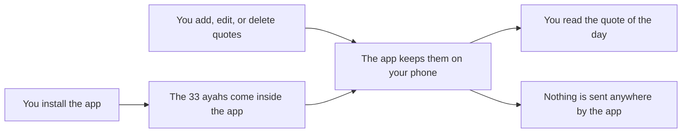

# Privacy and Offline Use

We want you to feel safe using this app.

## Works fully offline

- All 33 ayahs are stored inside the app.
- The quotes you add are kept on your phone.
- The app never uses the internet. It does not even ask Android for internet access.
- It works on a plane, in places with no signal, and with mobile data turned off.

This picture shows that everything stays on your phone.

## No permissions

The app asks for **no permissions**. It cannot see your contacts, photos, location, camera, microphone, or files.

## No data collection

- There is no account and no sign-up.
- The app does not collect or send any information about you.
- There are no ads and no tracking.

## What the app stores on your phone

- A copy of its own 33 ayahs, so it can show them quickly.
- The quotes you add in the **Quotes** tab, and any changes you make to the ayahs that come with the app. They stay on your phone. The app does not send them anywhere.

It does not store anything else about you.

## Backups

- The app's stored quotes, including **your own quotes** and the ayahs you edited or deleted, are part of your phone's normal Android backup, if you have backup turned on.
- They are also copied when you move to a new phone with Android's phone-to-phone transfer.
- So when you restore a backup on a new phone, your quotes can come back.
- If backup is off, your quotes stay only on this phone. Uninstalling the app removes them.
- On a new install with no backup, the app sets up its 33 ayahs again by itself. When you restore a backup, your edits and deletes come back as you left them.

The backup is made by Android, not by this app, and is stored where your phone keeps its backups (for example, your Google account). To check if backup is on, open your phone's **Settings** and search for **Backup**. The name of this menu can be a little different on each phone.

[Back to the User Guide](User-Guide.md)
