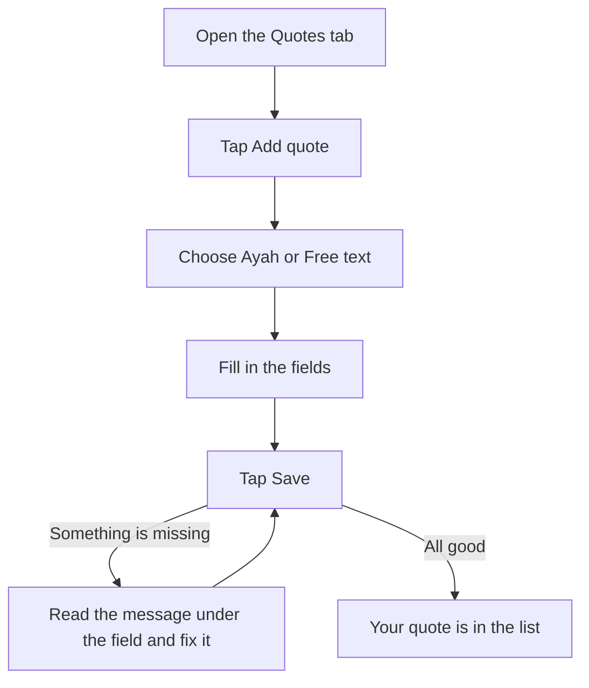
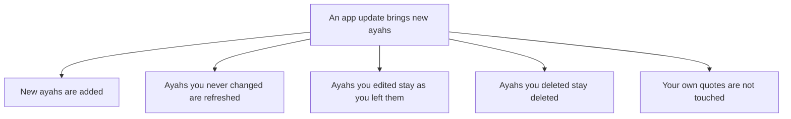

# Your Quotes

The **Quotes** tab shows every quote in the app. Here you add your own quotes, and you can edit or delete any quote, including the ayahs that come with the app.

## The Quotes tab

Tap **Quotes** in the bar at the bottom of the screen. The title **Quotes** is at the top in large letters. When you scroll down the list, it shrinks into a smaller bar.

You see a list of cards:

- First, the ayahs that come with the app, in order of surah and ayah number. Each card is labelled **Bundled ayah**. If you edited one, it is labelled **Bundled ayah, edited**.
- Then the quotes you added, in the order you added them. An ayah you added is labelled **My ayah**, and free text you added is labelled **My quote**.

Each card shows the start of the quote and its reference. Long text is cut short in the list. Every card has a pencil button to edit it and a bin button to delete it.

## Adding a quote

Tap the **Add quote** button at the bottom right of the Quotes tab. When you scroll down the list, the button shrinks to just a **+** sign. It still works the same way, and TalkBack still reads it as "Add quote".

The editor opens with the title **Add quote**. At the top, choose what kind of quote you want to add: **Ayah** or **Free text**. Fill in the fields, then tap **Save** at the top right. To leave without saving, tap the back arrow at the top left.

This picture shows how you add a quote.

### Adding an ayah

Choose **Ayah**. All five fields are needed:

- **Surah name**: for example, the name of the surah in English.
- **Surah number**: a whole number from 1 to 114.
- **Ayah number**: a whole number, 1 or more.
- **Arabic text**: the words of the ayah in Arabic.
- **Translation**: the meaning, in any language you like.

Please copy the Arabic text and the translation carefully from a trusted source.

### Adding free text

Choose **Free text**. This is good for a translation in your own language, a short reminder, or any words you want to see.

- **Text**: needed. You can write in any language.
- **Reference (optional)**: for example, where the words come from. You can leave it empty.

### If something is missing

When you tap **Save**, the app checks each field. If a field needs a change, a short message appears under it:

- **Required**: this field is empty.
- **Enter a whole number**: type a number, like 5, with no letters.
- **Enter a number from 1 to 114**: the surah number is outside this range.
- **Enter 1 or more**: the ayah number is too small.

Fix the field and tap **Save** again. If the app says "Could not save the quote. Please try again.", tap **Save** once more.

## Editing a quote

On any card, tap the pencil button (TalkBack reads it as "Edit quote"). The editor opens with the title **Edit quote**. Change what you want and tap **Save** at the top right, or tap the back arrow to leave without saving.

When you edit, the choice between **Ayah** and **Free text** is not shown, because a quote keeps its kind. To change an ayah into free text, or free text into an ayah, add a new quote and delete the old one.

## Editing a bundled ayah

The ayahs that come with the app can be edited like your own quotes, with the same five ayah fields. After you save, the card is labelled **Bundled ayah, edited**, and it stays with the other bundled ayahs in the list.

Your change is only in your copy of the app. The original text comes from trusted sources, so please change it with care. If you think a text or translation is wrong, please tell us. See [Quran sources](User-Quran-Sources.md).

## Deleting a quote

On any card, tap the bin button (TalkBack reads it as "Delete quote"). The app asks "Delete this quote?" and says "It will be removed. This cannot be undone." Tap **Delete** to remove it, or **Cancel** to keep it.

This works for the ayahs that come with the app too. A deleted quote does not come back on its own. If you want a deleted bundled ayah again, you can add it yourself as an ayah with **Add quote**. It then shows as **My ayah**, with your other quotes.

## When the app updates

An app update can bring new ayahs with it. Your changes are kept:

- New ayahs are added to your list.
- Bundled ayahs you never changed are refreshed to the new version.
- Bundled ayahs you edited stay exactly as you left them.
- Bundled ayahs you deleted stay deleted.
- The quotes you added are not touched.

If an update takes an ayah out of the app, it is also taken out of your list, but only if you never edited it. An ayah you edited stays.

This picture shows what an app update does with your changes.

## Your quotes on the Home tab

Every quote in the list, including the ones you added and the ones you edited, takes turns as the quote of the day. See [The daily quote](User-Daily-Ayah.md).

[Back to the User Guide](User-Guide.md)
