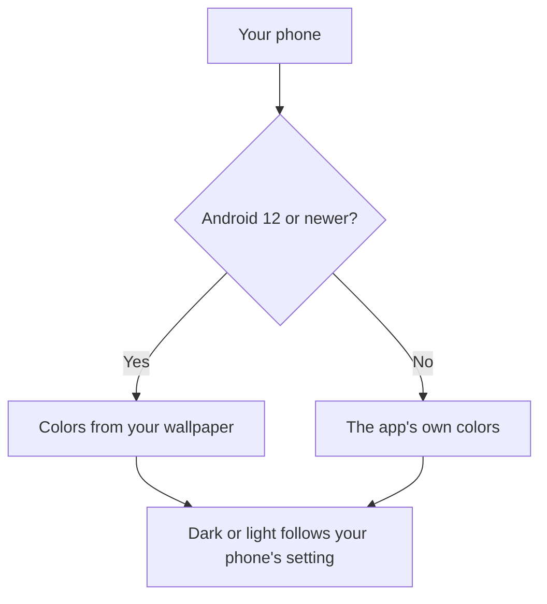

# Reading Comfort

The app follows your phone's settings, so it can be comfortable for your eyes and your needs. There are no settings inside the app yet.

## Dark mode and light mode

- If your phone uses dark mode, the app is dark.
- If your phone uses light mode, the app is light.
- When you change this in your phone's settings, the app changes too.

## Colors

- **Android 12 and newer:** the app's colors follow your wallpaper (this is called Material You). So the app can look different on two phones.
- **Android 11 and older:** the app uses its own fixed colors.

This picture shows which colors you get.

## Large text

- The app follows your phone's **font size** setting.
- The Arabic text gets more space between lines as the text grows, so it stays easy to read.
- With large text, you can scroll the screen to see everything, including the **Retry** button if it appears.

To change the font size, open your phone's **Settings** and look for **Display** or **Accessibility**, then **Font size**.

## TalkBack (screen reader)

The app works with TalkBack, the Android screen reader:

- The title "Ayah of the day" is marked as a heading, so you can jump to it.
- The Arabic text is marked as Arabic. TalkBack can read it with an Arabic voice, if one is installed on your phone.
- While the ayah is loading, TalkBack says "Loading today's ayah".
- If loading fails, TalkBack reads the error message for you, without cutting off other speech.

Tip: to hear the Arabic well, install an Arabic voice in your phone's text-to-speech settings.

[Back to the User Guide](User-Guide.md)
