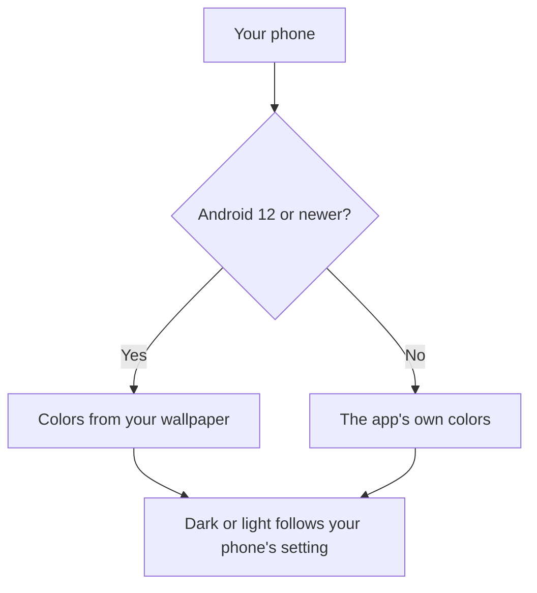

# Reading Comfort

The app follows your phone's settings, so it can be comfortable for your eyes and your needs. You cannot change these settings inside the app yet. The **Settings** tab shows that theme and text size follow your phone. See [Settings](User-Settings.md).

## Dark mode and light mode

- If your phone uses dark mode, the app is dark.
- If your phone uses light mode, the app is light.
- When you change this in your phone's settings, the app changes too.

## Colors

- **Android 12 and newer:** the app's colors follow your wallpaper (this is called Material You). So the app can look different on two phones.
- **Android 11 and older:** the app uses its own fixed colors.

This picture shows which colors you get.

## Large text

- The app follows your phone's **font size** setting.
- The Arabic text gets more space between lines as the text grows, so it stays easy to read.
- With large text, you can scroll the screen to see everything, including the **Retry** button if it appears.
- The large title at the top of Home, Quotes, and Settings shrinks as you scroll, which leaves more room for the text.

To change the font size, open your phone's **Settings** and look for **Display** or **Accessibility**, then **Font size**.

## TalkBack (screen reader)

The app works with TalkBack, the Android screen reader:

- The title at the top of each screen, and the card heading, "Ayah of the day" or "Quote of the day", are marked as headings, so you can jump to them.
- In the Quotes tab, the add button is read as "Add quote", even when it has shrunk to just a **+** sign. The buttons on each card are read as "Edit quote" and "Delete quote".
- The Arabic text of an ayah is marked as Arabic. TalkBack can read it with an Arabic voice, if one is installed on your phone.
- While the quote is loading, TalkBack says "Loading today's quote".
- If loading fails, TalkBack reads the error message for you, without cutting off other speech.

Tip: to hear the Arabic well, install an Arabic voice in your phone's text-to-speech settings.

[Back to the User Guide](User-Guide.md)
